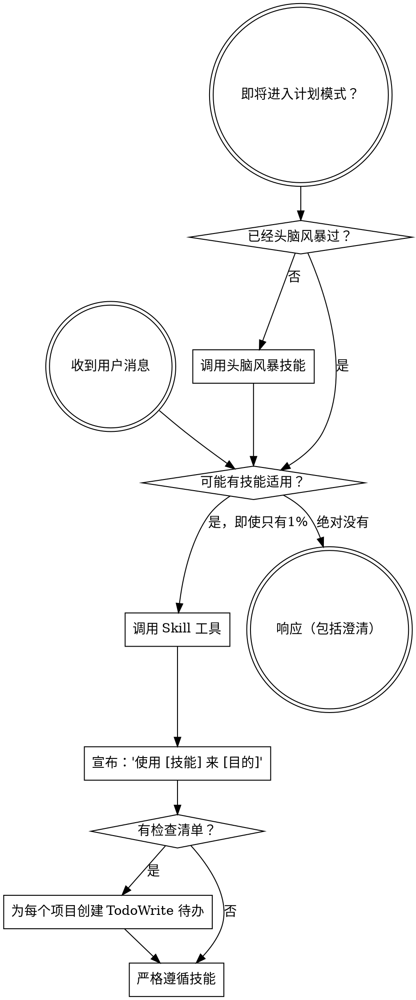

<至关重要>
如果你认为哪怕只有 1% 的可能性某个技能可能适用于你正在做的事情，你绝对必须调用该技能。

如果某个技能适用于你的任务，你没有选择权。你必须使用它。

这不可商量。这不是可选的。你无法通过合理化来回避这一点。
</至关重要>

## 如何访问技能

**在 Claude Code 中：** 使用 `Skill` 工具。当你调用一个技能时，其内容会被加载并呈现给你——直接遵循它。永远不要使用 Read 工具读取技能文件。

**在其他环境中：** 查看你平台的文档，了解技能是如何加载的。

# 使用技能

## 规则

**在任何响应或操作之前调用相关或请求的技能。** 即使只有 1% 的可能性某个技能可能适用，也意味着你应该调用该技能来检查。如果调用的技能证明不适合当前情况，你不需要使用它。

## 危险信号

这些想法意味着停止——你在自我合理化：

| 想法 | 现实 |
|------|------|
| "这只是个简单的问题" | 问题也是任务。检查是否有技能适用。 |
| "我需要先获取更多上下文" | 技能检查在澄清问题之前进行。 |
| "让我先探索代码库" | 技能告诉你如何探索。先检查技能。 |
| "我可以快速检查 git/文件" | 文件缺乏对话上下文。检查是否有技能。 |
| "让我先收集信息" | 技能告诉你如何收集信息。 |
| "这不需要正式的技能" | 如果技能存在，就使用它。 |
| "我记得这个技能" | 技能会演变。阅读当前版本。 |
| "这不算是一个任务" | 行动 = 任务。检查是否有技能。 |
| "这个技能太小题大做了" | 简单的事情会变得复杂。使用它。 |
| "我先做这一件事" | 在做任何事情之前先检查。 |
| "这感觉很高效" | 不自律的行动浪费时间。技能可以防止这种情况。 |
| "我知道那是什么意思" | 知道概念 ≠ 使用技能。调用它。 |

## 技能优先级

当多个技能可能同时适用时，按此顺序使用：

1. **流程技能优先**（头脑风暴、调试）- 这些决定了如何处理任务
2. **实现技能其次**（前端设计、mcp-builder）- 这些指导执行

"让我们构建 X" → 先头脑风暴，然后是实现技能。
"修复这个 bug" → 先调试，然后是领域特定技能。

## 技能类型

**严格型**（TDD、调试）：严格遵循。不要偏离规范。

**灵活型**（模式）：根据上下文调整原则。

技能本身会告诉你属于哪种类型。

## 用户指令

指令说的是做什么，不是怎么做。"添加 X"或"修复 Y"并不意味着跳过工作流程。
