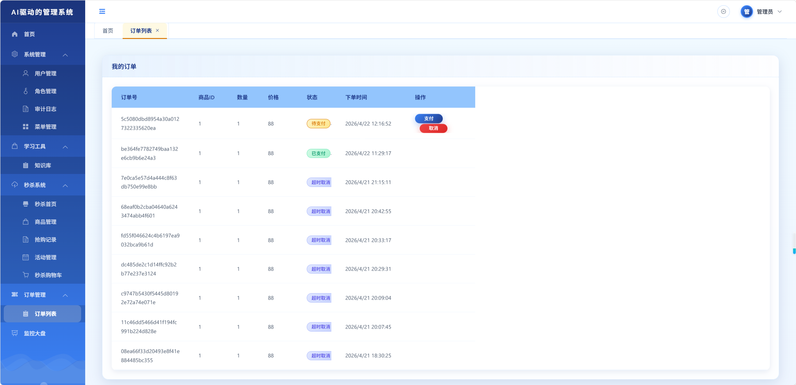

# 后台管理系统


<p align="center">
  <a href="#">
    
  </a>
  <a href="#">
    
  </a>
  <a href="#">
    
  </a>
</p>

## 📸 页面预览
<p align="center">
  
</p>
<p align="center">
  
</p>


## 📋 项目简介

这是一个基于 Spring Boot 4 和 Vue 3 的现代化后台管理系统，使用 AI 编程工具完成开发。

- **前端**：Vue 3.5 + Vite 8 + TypeScript
- **后端**：Spring Boot 4.0.5 + Java 26 + MyBatis Plus
- **数据库**：MySQL + Flyway 数据库迁移
- **认证**：JWT 令牌认证
- **UI 组件**：Element Plus
- **富文本编辑器**：WangEditor

## 🚀 快速开始

### 环境要求

- **前端**：Node.js v20.19+ 或 v22.12+
- **后端**：Java 26+
- **数据库**：MySQL（数据库名 `admin_system`，本地默认 root/123456）
- **缓存**：Redis 8.0+（秒杀系统必需）
- **消息队列**：RocketMQ 5.3.2（秒杀系统必需）

### 安装与运行

#### 前端

```powershell
# 进入前端目录
cd app-vue

# 安装依赖
npm install

# 开发模式（热重载，端口 5173）
npm run dev

# 生产构建
npm run build

# 预览生产构建
npm run preview
```

#### 后端

```powershell
# 进入后端目录
cd springboot

# 运行应用
./mvnw.cmd spring-boot:run

# 编译打包
./mvnw.cmd package
```

## 📁 项目结构

```
vibe_coding/
├── .opencode/          # AI 工具配置（skill、agent 等）
│   └── skills/
│       └── browser-msedge/  # 浏览器自动化脚本
├── .planning/          # GSD 日志文件
├── app-vue/            # 前端项目源码
│   ├── src/
│   │   ├── api/        # API 服务层
│   │   ├── components/ # 公共组件
│   │   ├── views/      # 页面视图
│   │   ├── router/     # 路由配置
│   │   └── store/      # 状态管理
│   └── vite.config.js  # Vite 配置
├── docs/               # 项目文档
│   ├── seckill/        # 秒杀系统文档
│   ├── browser-automation-guide.md  # 浏览器自动化指南
│   └── images/         # 项目图片
├── springboot/         # 后端源码目录
│   ├── src/
│   │   ├── main/java/  # Java 代码
│   │   └── resources/  # 资源文件
│   └── pom.xml         # Maven 配置
├── AGENTS.md           # AI 开发说明文档
└── README.md           # 项目说明文档
```

## ✨ 核心功能

### 系统管理
- **用户管理**：用户CRUD、角色分配
- **角色管理**：角色CRUD、权限配置
- **菜单管理**：菜单配置、权限控制

### 知识库管理
- **文章管理**：富文本编辑、标签管理
- **分类管理**：树形分类结构
- **标签管理**：标签创建与管理
- **文件上传**：支持图片和附件上传

### 审计日志
- **操作日志**：自动记录用户操作
- **登录日志**：记录用户登录信息

### 秒杀系统
完整的秒杀/高并发电商活动平台，支持海量并发抢购：

**活动管理**
- 秒杀活动创建、开启、结束
- 活动时间线管理
- 限购数量控制

**商品管理**
- 秒杀商品上架
- 原价/秒杀价对比
- 库存管理

**抢购功能**
- 签名验证（防请求篡改）
- 多层限流保护（QPS限流、并发限流、IP限流）
- 风控保护（黑名单、幂等性保证）
- 异步订单处理（RocketMQ事务消息）
- 排队机制（SSE实时推送）

**订单管理**
- 待支付订单支付
- 订单取消（用户主动/超时自动）
- 订单状态追踪

**实时监控（管理员）**
- 并发处理数监控
- QPS统计
- 活动时间线

**技术架构**
| 层次 | 技术 | 作用 |
|------|------|------|
| 第一层 | Redis原子操作 | 高性能库存预扣减 |
| 第二层 | RocketMQ消息队列 | 削峰填谷，控制数据库写入并发 |
| 第三层 | 数据库乐观锁 | 最终一致性保障，防止超卖 |

详细文档：
- 用户手册：`docs/seckill/user-guide.md`
- 开发手册：`docs/seckill/developer-guide.md`
- 运维指南：`docs/seckill/operation-guide.md`

## 🔧 开发流程

本项目使用基于 GSD（Get Shit Done）的开发流程：

1. **提出问题**：初步分析 `/gsd-new-project`
2. **拆解问题**：讨论技术方案，产出需求 `/gsd-discuss-phase N`
3. **技术分析**：发现标准技术栈、架构模式、常见陷阱。`/gsd-research-phase N`
3. **拆解问题**：讨论UI方案，产出需求 `/gsd-ui-phase N`
3. **详细设计**：针对单个需求进行设计 `/gsd-plan-phase N`
4. **执行编码**：实现功能 `/gsd-execute-phase N`
5. **功能测试**：验证功能正确性 `/gsd-verify-work N`
6. **完成里程碑**：结束本轮开发 `/gsd-complete-milestone`
7. **开始新里程**：启动新一轮开发 `/gsd-new-milestone`

## 🛠 技术栈

| 类别 | 技术 | 版本 |
|------|------|------|
| **前端框架** | Vue | 3.5+ |
| **构建工具** | Vite | 8+ |
| **类型系统** | TypeScript | - |
| **UI库** | Element Plus | - |
| **状态管理** | Pinia | - |
| **路由** | Vue Router | - |
| **HTTP客户端** | Axios | - |
| **后端框架** | Spring Boot | 4.0.5 |
| **语言** | Java | 26 |
| **ORM** | MyBatis Plus | - |
| **缓存** | Redis | 8.0+ |
| **消息队列** | RocketMQ | 5.3.2 |
| **数据库迁移** | Flyway | - |
| **认证** | JWT | - |

## 📚 文档

- **开发文档**：`AGENTS.md` - AI开发说明文档
- **项目文档**：`docs/` 目录下的相关文档

## 🔍 问题分析

对于复杂场景的分析，使用 `/brainstorming` 进行头脑风暴，帮助理清思路和解决方案。

## 📦 技能依赖

1. **GSD**：安装到 `.opencode` 目录 `npx gsd-opencode@latest`
2. **Superpower**：汉化版本 `npx superpowers-zh`
3. **浏览器访问**：动态渲染页面使用 `.opencode/skills/browser-msedge/fetch-page.js`

## 🔧 配置说明

- **npm镜像**：`npm config set registry https://registry.npmmirror.com`
- **数据库配置**：`springboot/src/main/resources/application.yaml`
- **浏览器自动化**：`docs/browser-automation-guide.md` 或 `.opencode/skills/browser-msedge/`

## 🤝 贡献

欢迎提交 Issue 和 Pull Request 来改进这个项目！

## 📄 许可证

本项目采用 GPL-3.0 许可证 - 详情请参阅 [LICENSE](LICENSE) 文件

## 🌟 鸣谢

- [Vue.js](https://vuejs.org/)
- [Spring Boot](https://spring.io/projects/spring-boot)
- [Element Plus](https://element-plus.org/)
- [MyBatis Plus](https://baomidou.com/)
- [GSD](https://github.com/gsd-2/get-shit-done)
- [Superpower](https://github.com/obra/superpowers)

---

<p align="center">
  Made with ❤️ by AI + Human Collaboration
</p>