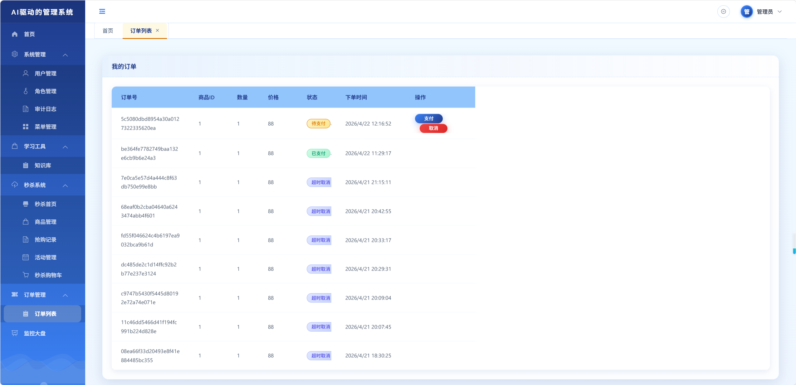

<p align="center">
  <h1 align="center">vibe_coding</h1>
  <p align="center">
    基于 Spring Boot 4 + Vue 3 的现代化后台管理系统
    <br />
    AI 辅助编程 · 全栈类型安全 · 高并发就绪
  </p>
</p>

<p align="center">
  <a href="#"></a>
  <a href="#"></a>
  <a href="#"></a>
  <a href="#"></a>
  <a href="#"></a>
  <a href="#"></a>
</p>

---

## 页面预览

<p align="center">
  
  <br />
  
</p>

---

## 项目简介

现代化企业级后台管理系统，覆盖系统管理、知识库、高并发秒杀、硬件监控四大业务域。前后端分离架构，全栈 TypeScript / Java 类型安全。

### 技术栈

| 类别 | 技术 | 版本 |
|------|------|------|
| 前端框架 | Vue (Composition API) | 3.5+ |
| 构建工具 | Vite | 8+ |
| UI 组件库 | Element Plus | — |
| 状态管理 | Pinia | — |
| 可视化 | ECharts | 6.x |
| 后端框架 | Spring Boot | 4.1.0-RC1 |
| 语言 | Java | 26 |
| 构建工具 | Gradle (Kotlin DSL) | 9.5 |
| ORM | MyBatis Plus | 3.5.x |
| 缓存 | Redis | 8.0+ |
| 消息队列 | RocketMQ | 5.3.2 |
| 数据库迁移 | Flyway | — |
| 认证 | JWT (jjwt 0.13) | — |
| 代码质量 | ArchUnit / Checkstyle / PMD / SpotBugs / Error Prone / JaCoCo | — |
| 前端 Lint | ESLint 10.x flat config + Stylelint 17.x | — |

---

## 核心功能

### 系统管理

用户、角色、菜单的完整 CRUD 与权限分配，支撑后台基础运营。

- **用户管理** — 用户 CRUD、角色分配、状态管理
- **角色管理** — 角色 CRUD、菜单权限配置
- **菜单管理** — 树形菜单配置、权限标识绑定

### 知识库管理

企业级内容管理模块，支持富文本编辑、分类组织和标签体系。

- **文章管理** — WangEditor 富文本编辑、标签绑定
- **分类管理** — 无限级树形分类
- **标签管理** — 标签创建、文章关联

### 审计日志

基于 AOP 切面的自动操作审计，零侵入记录用户行为。

- **操作日志** — 方法级别自动记录（CRUD 前缀推断）
- **登录日志** — 登录成功/失败记录与回溯

### 秒杀系统

完整的高并发秒杀/抢购平台，Redis 原子预扣减 + RocketMQ 事务消息 + 数据库乐观锁三层架构。

| 层次 | 技术 | 作用 |
|------|------|------|
| 第一层 | Redis 原子操作 | 高性能库存预扣减 |
| 第二层 | RocketMQ 事务消息 | 削峰填谷，异步落库 |
| 第三层 | 数据库乐观锁 | 最终一致性，防超卖 |

**关键能力：** 签名防篡改 · QPS/并发/IP 三层限流 · 黑名单风控 · SSE 实时排队推送 · 订单超时自动取消

### 硬件监控（v1.8）

Windows 服务器硬件负载实时监控面板，OSHI 7.x FFM 采集 + SSE 推送 + ECharts 可视化。

- **实时仪表盘** — CPU/内存环形图，2s SSE 推送刷新
- **磁盘监控** — 分区容量进度条 + IOPS/读写速率实时折线图
- **网络监控** — 上下行带宽实时折线图，60 点滑动窗口
- **趋势分析** — CPU/内存近 1 小时趋势线，30s 自动轮询
- **系统信息** — OS 版本、运行时间、进程数一览

---

## 快速开始

### 环境要求

- **Node.js** v20.19+ 或 v22.12+
- **Java** 26+
- **MySQL**（数据库 `admin_system`，默认 root/123456）
- **Redis** 8.0+（秒杀系统必需）
- **RocketMQ** 5.3.2（秒杀系统必需）

### 前端

```bash
cd app-vue
npm install
npm run dev      # 开发（端口 5173）
npm run build    # 生产构建
npm run test     # 单元测试
npm run lint     # ESLint + Stylelint
```

### 后端

```bash
cd springboot
./gradlew.bat bootRun              # 运行（端口 8080）
./gradlew.bat build                # 编译打包
./gradlew.bat test                 # 测试
./gradlew.bat check                # 全量代码质量检查
```

---

## 项目结构

```
vibe_coding/
├── .planning/                     # GSD 规划与进度追踪
├── app-vue/                       # Vue 3 前端
│   └── src/
│       ├── api/                   # API 层（按业务域拆分）
│       ├── components/            # 通用/布局/业务组件
│       ├── composables/           # 组合式函数
│       ├── views/                 # 页面（auth/dashboard/system/
│       │                          #       seckill/knowledge/monitor）
│       ├── router/                # 路由（模块拆分 + 守卫）
│       └── store/                 # Pinia 状态
├── springboot/                    # Spring Boot 后端
│   └── src/main/java/cn/coderstory/springboot/
│       ├── shared/                # 通用层（config/security/aspect/
│       │                          #       exception/util/limiter）
│       └── {domain}/              # 业务域：user/role/menu/auth/
│                                  #   audit/knowledge/seckill/
│                                  #   rocketmq/order/monitor
│           ├── controller/
│           ├── service/
│           ├── mapper/
│           └── entity/
├── docs/                          # 项目文档
│   ├── seckill/                   # 秒杀系统文档
│   └── ...                        # 开发指南/注释规范
├── CLAUDE.md                      # AI 协作指南
└── README.md
```

---

## 项目历程

| 版本 | 里程碑 | 状态 |
|------|--------|------|
| v1.0 | 基础框架（Vue 3 + Element Plus + Spring Boot） | 已发布 |
| v1.1 | 夏日海滩风主题修复 | 已发布 |
| v1.2 | 用户管理模块 | 已发布 |
| v1.3 | RocketMQ 管理（Topic/Consumer/消息/监控） | 已发布 |
| v1.4 | Maven → Gradle + Spring Boot 4.1 + 依赖升级 | 已发布 |
| v1.5 | 代码重构（质量工具链/包结构/配置拆分） | 已发布 |
| v1.6 | 代码深度清理（后端/前端/依赖/配置） | 已发布 |
| v1.7 | 注释与文档工程（标准/配置/代码/维护） | 已发布 |
| v1.8 | Windows 硬件负载监控（采集/SSE/图表） | 执行中 |

---

## AI 协作

本项目以 AI 辅助编程为核心开发方式。

- **AI 配置**：`CLAUDE.md` — Claude Code 工作指南
- **开发流程**：GSD（Discuss → Plan → Execute → Verify）
- **语言策略**：默认中文，技术术语保留英文
- **质量门禁**：TDD 铁律 · 提交前自检 · 全量代码质量检查

---

## 文档索引

| 文档 | 说明 |
|------|------|
| `CLAUDE.md` | AI 编程指南与项目规范 |
| `docs/seckill/user-guide.md` | 秒杀系统用户手册 |
| `docs/seckill/developer-guide.md` | 秒杀系统开发手册 |
| `docs/seckill/operation-guide.md` | 秒杀系统运维指南 |
| `docs/comment-standards.md` | 注释规范详细说明 |
| `docs/browser-automation-guide.md` | 浏览器自动化指南 |

---

## 许可证

本项目采用 [GPL-3.0](LICENSE) 许可证。

<p align="center">
  <sub>Made with AI + Human Collaboration</sub>
</p>
