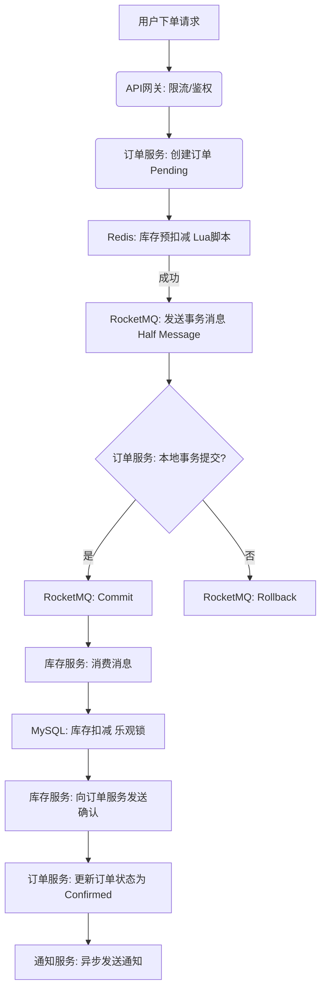

---
AIGC:
  ContentPropagator: 001191******M000100Y43
  Label: 1
  ReservedCode1: d41d8cd98f00b204e9800998ecf8427e
  ProduceID: 123456
  ReservedCode2: d41d8cd98f00b204e9800998ecf8427e
  PropagateID: 123456
  ContentProducer: 001191******M000100Y43
---

# Java架构师面试准备：电商行业高并发与大规模服务端开发实战指南

## 引言

在当今的电子商务时代，高并发与大规模服务端开发能力已成为衡量一名Java架构师是否合格的核心标准。电商系统不仅需要处理日常的用户流量，更要应对如“秒杀”、“大促”等极端场景，这对系统的性能提出了极为严苛的要求。本报告将深入剖析Java高并发与大规模服务端开发的核心技术栈，并结合电商行业的实战案例，为Java架构师面试提供一份全面的准备指南。报告将从并发编程、分布式缓存、数据库优化、消息队列、最终一致性架构及服务治理等多个维度，系统性地阐述构建高性能、高可用、高扩展性电商后端系统的关键技术与最佳实践。

## 一、高并发系统架构设计原理

### 1.1 电商高并发场景与挑战

电子商务平台的后端系统在日常运营中无时无刻不承受着高并发的压力。从用户的浏览、搜索、下单，到支付、物流跟踪，每一个环节都涉及大量数据的读写与复杂业务逻辑的处理 [23]。特别是在“618”、“双11”等促销活动中，系统的访问流量会呈现爆发式增长，数倍于日常的并发量集中冲击系统的各个服务节点 [23]。这种极端场景对后端服务提出了三大核心挑战：

1.  **高性能（High Performance）**：系统必须能够在极短的时间内处理海量请求，确保用户操作的流畅性，避免出现卡顿或无响应的情况 。  
2.  **高可用（High Availability）**：系统需要具备“永远在线”的能力，即使在部分硬件或软件组件发生故障时，也能通过冗余和故障转移机制，对外继续提供服务，最大限度地减少停机时间 [11]。  
3.  **可扩展性（Scalability）**：系统的处理能力不能成为瓶颈。当业务量增长时，架构必须支持通过增加服务器节点（Scale-out）来线性提升整体性能，以应对不断增长的业务需求 [23]。

为了应对这些挑战，现代电商系统广泛采用微服务架构，将一个庞大的单体应用拆分为多个职责单一 、独立部署的服务，如用户服务、商品服务、订单服务、库存服务等 [23]。这种架构模式不仅提升了系统的模块化和可维护性，更重要的是，它允许对特定的热点服务（如在秒杀期间对库存服务）进行针对性的独立扩展，从而更灵活地调配资源。

### 1.2 核心设计原则与高可用架构模式

构建一个能够承受高并发冲击的电商系统，架构设计必须遵循一系列核心原则，并结合多种高可用模式。

#### **1. 互联网架构核心原则**

* **无状态设计（Stateless Design）**：服务本身不保存任何与客户端会话相关的状态信息。所有状态数据都存储在外部的共享存储中，如Redis 。  
  * **优势**：无状态服务可以方便地水平扩展。负载均衡器（如Nginx或API网关）可以将请求分发到任意一个服务实例，而不用担心请求路由到错误的节点，从而极大地简化了扩展和运维的复杂度 [23]。  
* **幂等性设计（Idempotence Design）**：无论同一个操作被执行一次还是多次，其对系统状态的影响都应该与执行一次相同。  
  * **重要性**：在高并发和分布式环境中，网络超时、重试机制是普遍存在的。如果接口不具备幂等性，一次支付请求在网络超时后重试，可能会导致用户被扣款两次，造成严重的资损事故 [23]。  
  * **实现方式**：通过业务唯一键（如订单号、用户ID+商品ID）、分布式锁、状态机等机制来确保操作的幂等性 [23]。  
* **服务自治（Service Autonomy）**：每个服务应该拥有其独立的数据库、代码库和运行时环境。一个服务的故障不应直接拖垮其他服务 。  
  * **价值**：这种解耦设计使得系统更加健壮，便于团队的独立开发和部署，是实现独立伸缩的基础 。

#### **2. 流量控制与故障隔离**

当海量请求涌来时，不可能所有请求都能被后端服务同步处理完毕。架构师必须做出选择：是牺牲部分请求的即时响应性，还是保护核心服务的稳定性？高可用架构的核心设计通常围绕“保护服务”展开 ，其关键策略包括：

* **流量控制**：对进入系统的流量进行管理和限制，防止其超过系统的处理阈值。  
  * **限流**：使用令牌桶或漏桶算法，在API网关层限制某个接口或某个用户的访问频率 [23]。例如，通过Nginx的  
    `limit_req`模块进行限流 [1]。  
  * **降级**：在系统压力过大时，有策略地关闭一些非核心功能或服务，将资源让给核心交易链路。例如，在大促期间，可以临时关闭商品评论功能 [11]。  
* **并发控制**：限制系统资源的过度占用。  
  * **线程隔离/舱壁隔离（Bulkheads）**：为不同的服务调用分配独立的线程池。如果一个服务（如“获取推荐列表”）因故障导致其线程池被阻塞耗尽，也不会影响到处理核心业务（如“创建订单”）的线程池，从而隔离故障 。  
* **故障隔离**：防止一个服务的失败引发多米诺骨牌效应，导致整个系统崩溃。  
  * **熔断（Circuit Breaker）**：当下游服务（如库存服务）的错误率或响应时间超过阈值时，熔断器会“跳闸”，后续的请求将不再被转发，而是快速失败并返回降级结果。这防止了调用方线程被长时间阻塞 。一段时间后，熔断器会进入半开状态，尝试转发少量请求以探测服务是否恢复。

#### **3. 数据管理策略**

* **多级缓存（Multi-level Cache）**：这是抵御数据库压力、提升系统响应速度的基石。  
  * **架构**：通常采用“本地缓存 + 分布式缓存”的两级或三级架构 [11]。  
    * **第一级**：本地缓存（如Caffeine），用于存储访问频率极高、且不常变动的“热数据”（如某款秒杀商品的信息）。  
    * **第二级**：分布式缓存（如Redis集群），作为一个统一的、容量更大的缓存层，存储各种被频繁访问的数据（如用户会话、商品列表页）。  
    * **第三级**：当缓存未命中时，才会查询数据库 [11]。  
  * **预热**：对于已知会被高频访问的数据（如即将开始的秒杀商品），应在活动开始前主动将其加载到缓存中，以应对流量洪峰 [11]。  
* **读写分离（Read/Write Separation）与分库分表（Sharding）**：  
  * **读写分离**：主数据库（Master）处理写操作（增、删、改），并将数据变更通过主从复制同步到多个只读从数据库（Slave）。读请求被负载均衡器分发到各个从库，从而显著提升数据库集群的整体读取能力 [1]。  
  * **分库分表**：当单表数据量过大（如用户表超过500万行）时，查询性能会急剧下降 [11]。此时，通常根据某个业务键（如  
    `user_id`的哈希值）将一张大表水平切分到多个数据库实例中，实现数据的分布式存储，有效分散单节点的压力 [23]。

#### **4. 异步化与最终一致性**

在高并发场景下，试图用同步调用的方式保证强一致性，往往会成为性能的瓶颈 。异步化和最终一致性是提升系统吞吐量的关键手段。

* **异步处理**：将非核心、耗时的操作从主流程中剥离出来，通过消息队列异步执行。例如，用户在下单成功后，支付成功的消息会被投递到消息队列（如Kafka、RocketMQ），由下游的消费服务异步地处理后续步骤，如发送支付成功通知、更新用户积分等。这种方式使主流程能够快速响应用户，无需等待这些耗时操作完成 [92]。  
* **最终一致性**：在分布式系统中，要求所有节点在同一时刻拥有完全相同的数据副本（强一致性）代价极高。系统设计者通常放宽一致性要求，允许数据在一段时间内处于不一致状态，但保证在经过一系列补偿或校对操作后，数据最终会达到一致的状态。例如，订单状态的更新和库存的扣减可以分别进行，通过后续的对账流程来确保两个系统间数据的最终一致 [11]。

这种架构思维的转变，是从传统的“处理请求”模式转向了“接受请求，排队处理”的模式 。通过缓存、消息队列等组件，系统将对实时同步处理的请求数量降低数个量级，极大地提升了核心服务的稳定性。然而，这也带来了一个面试中常被问及的核心权衡：一致性（Consistency）与可用性（Availability）之间的取舍，即CAP理论，以及延迟与可靠性之间的平衡。例如，将数据异步写入消息队列，可以极大地提升系统处理吞吐量和可用性，但会引入一定的延迟，并带来“消息丢失”或“重复消费”的风险 [1]。因此，架构师必须在数据的重要性和可容忍的延迟之间做出明智的决策。

## 二、Java并发编程深度进阶

### 2.1 线程模型与线程池的艺术

#### **1. 线程池核心参数深度剖析**

线程池是管理线程、控制并发执行的核心工具。其配置参数直接决定了系统在高负载下的行为表现 [25]。

* **corePoolSize（核心线程数）**：线程池中长期保持存活的线程数量，即使它们处于空闲状态 [53]。  
* **maximumPoolSize（最大线程数）**：线程池允许创建的最大线程数量，当任务队列满且当前线程数小于该值时，会创建新线程 [53]。  
* **keepAliveTime（线程空闲时间）**：当线程池中的线程数量超过`corePoolSize`时，空闲线程等待新任务的最长时间，超过此时间将被终止 [53]。  
* **unit（时间单位）**：与`keepAliveTime`配合使用的时间单位 [53]。  
* **workQueue（任务队列）**：用于保存等待执行任务的阻塞队列。其选择对线程池行为至关重要 ：  
  * **ArrayBlockingQueue**：基于数组的有界阻塞队列，常用于实现“有界任务队列”，防止无限制的任务堆积耗尽系统资源 [21]。  
  * **LinkedBlockingQueue**：基于链表的可选有界阻塞队列。若未指定容量，则默认为`Integer.MAX_VALUE`，即可视为无界队列 。  
  * **SynchronousQueue**：不存储元素的阻塞队列。每个插入操作必须等待另一个线程的移除操作，因此常用于直接传递任务，创建“按需启动”的线程池 。  
* **threadFactory（线程工厂）**：用于创建新线程的工厂，可以自定义线程的名称、优先级、是否为守护线程等属性，便于问题排查 [53]。  
* **handler（拒绝策略）**：当任务队列已满且线程池线程数已达到`maximumPoolSize`时，对新提交任务所采取的处理策略 。  
  * **AbortPolicy**：默认策略，直接抛出`RejectedExecutionException`异常 [21]。  
  * **CallerRunsPolicy**：由提交任务的线程（通常是主线程）自己来执行该任务 。  
  * **DiscardPolicy**：直接丢弃新提交的任务，不抛出异常 。  
  * **DiscardOldestPolicy**：丢弃任务队列中最旧的任务，然后尝试重新提交新任务 。

#### **2. 线程池的实践调优**

没有“万能”的线程池配置，最佳参数高度依赖于具体的应用场景和硬件资源 [84]。

* **CPU密集型任务**：这类任务主要消耗CPU资源。理论上，线程池大小设置为`CPU核心数 + 1`即可获得最佳性能。过多的线程会导致频繁的上下文切换，反而降低效率 [84]。  
* **I/O密集型任务**：这类任务（如数据库查询、网络调用）会经常处于等待状态。为了更充分地利用CPU，可以适当增大线程池大小。一个常用的经验公式是：`线程池大小 = CPU核心数 * 期望CPU利用率 * (1 + 平均等待时间 / 平均计算时间)` [84]。  
* **调优步骤**：  
  1. **确定目标**：明确系统的QPS、响应时间（RT）和错误率目标 [84]。  
  2. **压测验证**：使用JMeter等工具进行压力测试，模拟生产流量 [84]。  
  3. **监控指标**：监控线程池的关键指标，如当前线程数、活动线程数、队列大小、完成任务数以及拒绝任务数 。  
  4. **动态调整**：根据监控数据，分析瓶颈（是CPU限制还是I/O限制？队列是否经常满？），并动态调整核心线程数和最大线程数等参数 [84]。

一个特别需要注意的是，JDK提供的`Executors`工具类中的`newFixedThreadPool`和`newSingleThreadExecutor`方法默认使用无界的`LinkedBlockingQueue` 。如果任务提交速度长期大于处理速度，队列会无限增长，最终可能耗尽系统内存。因此，在电商等高并发场景中，更推荐使用`ThreadPoolExecutor`的构造函数，显式地指定有界队列（如`ArrayBlockingQueue`）和合理的拒绝策略，构建一个“有界”的线程池，以增强系统的健壮性。

### 2.2 探索CompletableFuture与异步编排

#### **1. 异步编程的演进：回调地狱与Future的局限**

在`CompletableFuture`出现之前，Java实现异步编程主要有两种方式，但都存在明显缺陷 ：

* **回调（Callbacks）**：通过嵌套回调函数来处理异步操作的结果。当异步操作多层嵌套时，代码会迅速陷入“回调地狱”（Callback Hell），变得难以阅读和维护 。  
* **Future**：`Future`接口代表了异步计算的结果，但它存在几个关键问题：  
  * **阻塞性**：获取结果必须通过阻塞的`get()`方法 。  
  * **无回调**：无法在任务完成后自动触发后续操作，需要手动轮询 。  
  * **不可组合**：难以优雅地处理多个`Future`之间的依赖关系，通常需要配合`CountDownLatch`等工具，代码冗余 。

#### **2. CompletableFuture：强大的异步编程工具**

`CompletableFuture`是Java 8引入的里程碑式特性，它实现了`Future`和`CompletionStage`接口，旨在解决上述痛点 。它既是异步任务结果的容器，也是支持链式调用和多任务编排的“编排引擎” 。

**核心优势**：

* **链式调用（Chaining）**：通过一系列`thenApply`, `thenAccept`, `thenRun`等方法，可以将多个异步任务以线性的、声明式的方式串联起来，彻底告别回调地狱 。  
* **组合能力（Combining）**：提供了`allOf`, `anyOf`, `thenCombine`等方法，可以轻松地将多个独立的异步任务的结果进行组合处理 [88]。  
* **异常处理（Exception Handling）**：提供了`exceptionally`, `handle`, `whenComplete`等统一的方式来处理链式调用中的异常，使得错误处理逻辑更加集中和优雅 。

#### **3. 核心API与创建方式**

`CompletableFuture`提供了四个静态方法来创建异步任务 ：

* `runAsync(Runnable runnable)`：执行一个无返回值的异步任务。  
* `supplyAsync(Supplier<T> supplier)`：执行一个有返回值的异步任务。

这两个方法都有重载版本，允许传入自定义的`Executor`线程池。如果不指定，则默认使用`ForkJoinPool.commonPool()` 。在服务器端开发中，强烈建议使用自定义线程池，以避免默认线程池成为系统瓶颈，并方便进行资源隔离和监控 。

#### **4. 结果获取与回调时机**

获取`CompletableFuture`的结果有多种方式，但应尽量避免在主线程中阻塞调用 [83]。

* **阻塞获取**：`get()`, `join()`。这两种方法都会阻塞当前线程直到结果返回。`join()`与`get()`的区别在于它不会抛出受检异常 [83]。  
* **非阻塞回调**：这是推荐的使用方式。通过`thenAccept`, `thenRun`, `whenComplete`等方法注册回调函数，当异步任务完成时，回调函数会被自动触发，主线程则无需等待，可以继续执行其他任务 。

**示例：电商商品详情页聚合**

商品详情页通常需要聚合来自多个微服务的数据，例如用户信息、商品基本信息、价格、库存、推荐列表等 [80]。使用`CompletableFuture`可以高效地实现并行调用，将总耗时从各服务耗时的总和降低到最大值。

```java
public ProductDetailDTO getProductDetail(Long productId, Long userId) {
    // 1. 创建并行任务，获取商品基础信息
    CompletableFuture<ProductInfo> productInfoFuture = CompletableFuture.supplyAsync(
        () -> productService.getProductInfo(productId), customExecutor);

    // 2. 创建并行任务，获取用户购物车数量
    CompletableFuture<Integer> cartCountFuture = CompletableFuture.supplyAsync(
        () -> cartService.getCartCount(userId), customExecutor);

    // 3. 创建并行任务，获取商品推荐列表
    CompletableFuture<List<Recommendation>> recommendationsFuture = CompletableFuture.supplyAsync(
        () -> recommendationService.getRecommendations(productId), customExecutor);

    // 4. 使用allOf等待所有任务完成
    CompletableFuture.allOf(productInfoFuture, cartCountFuture, recommendationsFuture).join();

    // 5. 获取所有结果并组装
    ProductInfo productInfo = productInfoFuture.join();
    Integer cartCount = cartCountFuture.join();
    List<Recommendation> recommendations = recommendationsFuture.join();

    ProductDetailDTO detailDTO = assembleProductDetail(productInfo, cartCount, recommendations);
    return detailDTO;
}
```

在这个例子中，三个服务调用是并行执行的，总的响应时间约等于最慢的那个服务的响应时间，而非三者之和。这种模式显著降低了接口的延迟，是提升电商系统性能的关键手段。

### 2.3 并发工具与集合类的实战应用

除了线程池和`CompletableFuture`，Java还提供了其他一系列强大的并发工具类和集合类，它们是构建高并发应用的“瑞士军刀”。

#### **1. 并发集合类**

在多线程环境下，使用非线程安全的集合类（如`ArrayList`, `HashMap`）会导致数据不一致和难以排查的并发Bug。`java.util.concurrent`包提供了线程安全的替代品 。

* **ConcurrentHashMap**：线程安全的哈希表，是`HashMap`的高并发替代。它采用“分段锁”（Segment Locking）或后来的CAS+Synchronized机制，允许多个读操作和一定数量的写操作并发进行，极大地提升了并发性能 。在电商系统中，常用于存储共享的用户会话数据、商品目录等 [25]。  
* **ConcurrentLinkedQueue**：线程安全的无界非阻塞队列，基于链表实现。它是`LinkedList`的高并发替代，适用于需要在高并发环境下进行安全入队和出队的场景 [29]。  
* **CopyOnWriteArrayList**：线程安全的`ArrayList`变体。它通过“写时复制”（Copy-On-Write）的策略，在写操作时复制整个底层数组。这种设计非常适合**读多写少**的场景，如电商系统中的权限列表、白名单列表等 [25]。

#### **2. 同步工具类**

* **CountDownLatch（闭锁）**：它允许一个或多个线程等待，直到在其他线程中执行的一组操作全部完成 。`CountDownLatch`在初始化时设置一个计数值，任何需要等待的线程调用`await()`方法进入阻塞状态。在其他线程中，每当完成一个子任务后，调用`countDown()`方法将计数器减1。当计数器减到0时，所有在`await()`上等待的线程会被唤醒 。  
  * **典型应用场景**：在电商系统中，一个服务可能需要依赖多个外部服务的返回结果才能继续执行。例如，在渲染一个复杂的运营页面时，需要同时从商品服务、广告服务、用户服务获取数据。可以在主线程中创建一个`CountDownLatch`，为每个依赖的服务创建一个子线程去调用，主线程调用`await()`等待所有结果返回 [81]。  
* **Semaphore（信号量）**：用于控制同时访问特定资源的线程数量 。它维护了一个许可证（permit）集，线程在访问资源前必须先通过`acquire()`方法获取一个许可证，使用后通过`release()`方法归还许可证。如果许可证已被全部占用，后续线程将被阻塞，直到有许可证被归还 。  
  * **典型应用场景**：在数据库连接池或HTTP连接池的实现中，`Semaphore`可以用来限制从池中获取物理连接的并发数，防止过多的连接请求压垮数据库或网络 [25]。  
* **CyclicBarrier（循环屏障）**：与`CountDownLatch`类似，它允许一组线程互相等待，直到所有线程都到达某个公共屏障点（barrier point） 。但与`CountDownLatch`不同的是，`CyclicBarrier`的屏障可以“循环利用”。在一次同步点达成、所有线程被释放后，`CyclicBarrier`可以重新设置屏障，用于下一次同步 。  
  * **典型应用场景**：在进行大规模数据分析或复杂计算的批处理任务中，可以将任务拆分成多个小任务，分配给不同的线程执行。所有线程必须在某个阶段（如数据预处理完成、第一阶段计算完成）同步，然后才能进入下一个阶段。`CyclicBarrier`就是实现这种多阶段并行计算的理想工具 [25]。

这些并发工具类提供了不同维度的线程协调能力。`CountDownLatch`关注的是“事件完成”，`Semaphore`管理的是“资源访问”，而`CyclicBarrier`则侧重于“线程间的相互会合”。正确理解和应用这些工具，是处理复杂并发逻辑的关键。

更进一步，我们可以将这些工具与前面提到的“异步化”架构理念结合思考。异步化并不仅仅意味着“更快”，它更是一种解耦和削峰填谷的策略。例如，电商系统中的商品详情页，本质上是一个数据聚合器，需要从多个服务获取数据。如果采用同步阻塞的方式，总耗时将是所有服务耗时之和。而通过`CompletableFuture`或`CountDownLatch`结合多线程的方式并行获取数据，总耗时将接近最慢的那个服务的耗时 [80]。这正是利用并发编程技术，将一个耗时的串行流程优化为高效的并行流程的绝佳范例，是实现高性能服务架构的基础。

## 三、驾驭分布式缓存与Redis高级特性

### 3.1 Redis核心数据结构与内存优化策略

#### **1. 核心数据结构及其应用场景**

Redis之所以强大，不仅在于其内存存储，更在于其丰富的数据结构，能够高效地解决各种业务问题 [17]。

* **String（字符串）**：最基础的数据类型，可以存储字符串、数字或二进制数据。  
  * **应用场景**：缓存简单对象（如用户信息、商品基本信息）、计数器、分布式锁的键 [32]。  
* **Hash（哈希）**：一个键值对集合，类似于Java中的`Map`。  
  * **应用场景**：存储对象的多个属性，如购物车（Key为用户ID，Field为商品SKU ID，Value为商品数量及属性）、用户会话信息。使用Hash比将整个对象序列化为字符串存储更高效，可以单独更新和获取某个字段 [31]。  
* **List（列表）**：简单的字符串列表，按照插入顺序排序。  
  * **应用场景**：消息队列（使用`LPUSH`/`RPOP`或`BRPOP`实现）、最新评论列表、简单的流处理 [32]。  
* **Set（集合）**：无序且不包含重复元素的字符串集合。  
  * **应用场景**：标签系统（如给商品打标签）、计算多个商品的交集/并集（如“买过A商品的人也买过B商品”）、抽奖系统、黑名单/白名单 [17]。  
* **Sorted Set（有序集合）**：类似于Set，但每个元素都关联一个分数（score），集合按分数排序。  
  * **应用场景**：排行榜（如按销量、按评分排序）、带权重的消息队列、范围查询 [32]。

#### **2. 内存管理与优化**

Redis将所有数据存储在内存中，因此内存管理至关重要。

* **数据过期策略**：  
  * **惰性过期（Lazy Expiration）**：Redis会定期检查并向客户端返回已过期的key。同时，每次访问key时也会检查其是否已过期并删除 。这种方式对内存使用比较友好，但可能会在短时间内浪费内存资源，如果过期key没有被访问的话 。  
  * **定期过期（Active Expiration）**：Redis每秒会进行10次随机测试，移除已过期且未活跃的key 。这是一个平衡性能和内存消耗的机制。  
* **内存淘汰机制**：当Redis的内存使用率超过`maxmemory`配置时，会触发内存淘汰。常见的策略有：  
  * **noeviction**：不淘汰任何键值对，新写入操作会返回错误。  
  * **allkeys\-lru**：在所有键中，移除最近最少使用（Least Recently Used, LRU）的键值对 。  
  * **volatile\-lru**：在所有设置了过期时间的键中，移除LRU的键值对。  
  * **allkeys\-random**：在所有键中，随机移除键值对。  
* **大Key治理**：  
  * **危害**：一个Value过大的Key（如一个包含数万个商品的购物车Hash）会严重影响Redis的单线程性能，导致后续命令排队等待，甚至可能引发分片不均和网络拥塞 。  
  * **解决方案**：  
    * **拆分**：将一个大Key拆分为多个小Key [17]。例如，将`cart:user:123`拆分为`cart:user:123:product:001`。  
    * **压缩**：对Value进行压缩（如使用GZIP），减小其内存占用 [32]。  
    * **清理**：定期清理过期的Key，特别是购物车这类临时数据 [31]。

### 3.2 分布式锁（Redisson）实战精解

#### **1. 分布式锁的业务需求**

在分布式系统中，多个服务实例可能并发地访问和修改同一个共享资源（如数据库中的库存记录）。传统的JVM内置锁（`synchronized`）无法跨进程工作，因此需要一个分布式的互斥机制——分布式锁 。

#### **2. 基于Redis的分布式锁**

Redis凭借其单线程模型和原子操作，是分布式锁的理想实现 。然而，自己基于`SETNX`命令实现一个健壮的分布式锁非常复杂，需要考虑原子性、防误删、可重入、续期、容错等问题 。`Redisson`客户端则提供了工业级的、开箱即用的分布式锁实现。

#### **3. Redisson分布式锁核心原理**

**核心特性**：

* **可重入锁（Reentrant Lock）**：与JUC中的`ReentrantLock`类似，同一个线程可以多次获取同一把锁，解锁时也需要执行相同次数的解锁操作才能真正释放锁。这对于锁内部调用其他需要锁的方法很有用 [51]。  
* **锁自动续期（Watch Dog）**：这是Redisson解决死锁问题的核心机制。当一个线程获取锁时，Redisson会在后台启动一个“守护线程”（看门狗）。如果线程的业务处理时间超过了锁的过期时间，看门狗会自动延长锁的过期时间（默认为30秒）。只要线程还在处理业务，锁就不会因为超时而被释放，有效避免了业务未完成锁却被自动释放的风险[48]。  
* **防死锁与容错**：锁设置了默认的过期时间，即使客户端宕机，锁也会自动释放，防止死锁 [50]。  
* **非阻塞尝试**：提供`tryLock(waitTime, leaseTime, unit)`方法，允许在指定的等待时间内尝试获取锁，并在获取成功后设置一个明确的自动释放时间。如果未获取到锁，线程不会无限等待 [51]。

#### **4. 代码实现**

```java
import org.redisson.api.RLock;
import org.redisson.api.RedissonClient;
import org.springframework.beans.factory.annotation.Autowired;
import org.springframework.stereotype.Service;

import java.util.concurrent.TimeUnit;

@Service
public class InventoryService {

    @Autowired
    private RedissonClient redissonClient;

    public void deductInventory(Long skuId, Integer quantity) {
        // 1. 定义锁的key
        String lockKey = "inventory_lock:" + skuId;
        RLock lock = redissonClient.getLock(lockKey);

        try {
            // 2. 尝试获取锁，最多等待5秒，锁自动释放时间为10秒
            boolean isLocked = lock.tryLock(5, 10, TimeUnit.SECONDS);
            if (!isLocked) {
                // 处理获取锁失败的情况，如抛出异常或返回错误
                throw new RuntimeException("系统繁忙，请稍后再试");
            }

            // 3. 执行业务逻辑（如查询库存、扣减库存）
            // ...
            System.out.println("执行库存扣减逻辑");

        } catch (InterruptedException e) {
            // 处理中断异常，恢复中断状态
            Thread.currentThread().interrupt();
            throw new RuntimeException("获取锁中断", e);
        } finally {
            // 4. 释放锁
            if (lock.isLocked() && lock.isHeldByCurrentThread()) {
                lock.unlock();
            }
        }
    }
}
```

### 3.3 应对缓存三大痛点的架构策略

#### **1. 缓存穿透（Cache Penetration）**

* **定义**：指查询一个在缓存中和数据库中都不存在的key。由于缓存不命中，每次请求都会直接打到数据库上，如果大量请求查询不存在的key，会给数据库带来巨大压力 [1]。  
* **解决方案**：  
  * **布隆过滤器（Bloom Filter）**：一种空间效率极高的概率型数据结构，用于判断一个元素**可能属于**一个集合或**一定不属于**一个集合。将所有存在的key（或其哈希值）预先放入布隆过滤器。在查询缓存前，先查询布隆过滤器，如果布隆过滤器判断该key不存在，则直接返回空结果，避免对数据库的访问 [17]。  
  * **缓存空值（Cache Null Values）**：对于查询结果为空的请求，同样将其缓存起来，但设置一个较短的过期时间。当后续有查询同一不存在的key的请求到来时，可以直接从缓存中返回空结果 [31]。

#### **2. 缓存击穿（Cache Breakdown）**

* **定义**：指一个**极其热点**的key，在缓存过期的瞬间，同时有大量并发请求涌来查询这个key。由于缓存刚好失效，所有请求都会瞬间穿透到数据库，试图从数据库加载数据，对数据库造成瞬时巨大压力 [17]。  
* **解决方案**：  
  * **互斥锁（Mutex Lock）**：当缓存未命中时，不是所有线程都去数据库查询，而是只允许一个线程去查询。其他线程在获取数据时，如果发现一个特殊的锁标记（如`lock:product:123`），则等待，直到那个线程完成数据库查询并更新缓存 [1]。  
  * **逻辑过期（Logical Expiration）**：在缓存中多存储一个字段表示数据的过期时间戳。当读取缓存发现数据已过期时，不直接返回，而是**先返回过期的旧数据**（给用户一个兜底），然后**在后台异步地**触发一个线程去更新缓存。这样可以保证用户总是能立即获取到数据（即使是旧的），而不会在缓存更新时出现服务不可用的情况。

#### **3. 缓存雪崩（Cache Avalanche）**

* **定义**：指在一个时间段内，大量的缓存key同时过期，导致瞬间所有的请求都直接打到数据库上，造成严重的系统性能问题和可用性风险 [31]。  
* **解决方案**：  
  * **随机过期时间**：在设置缓存key的过期时间时，不要设置成相同的固定值。可以在此基础上添加一个随机值（如0\-5分钟的随机秒数）。这样可以确保缓存key的过期时间分散，避免集体失效 [31]。  
  * **多级缓存**：除了分布式缓存，还可以引入本地缓存。即使Redis集群因为某种原因（如网络问题）暂时不可用，本地缓存仍然可以提供兜底数据，保证服务的基本可用性 [1]。  
  * **熔断限流**：在应用层面对数据库的访问进行监控和限流。如果数据库访问的慢查询数量或错误率突然激增，可以开启熔断或限流，避免数据库被压垮 [31]。

在面试中，对于缓存问题的讨论往往会深入到底层原理。例如，被问及缓存击穿的解决方案时，可能会进一步追问布隆过滤器的实现原理、哈希冲突的问题以及其空间效率 。或者，在讨论缓存雪崩时，会问及Redis的持久化机制（RDB和AOF）以及各自的优缺点 [17]。因此，理解这些解决方案背后的技术本质，而不仅仅是应用层面，是展现技术深度的关键。

## 四、数据库性能优化与高并发SQL调优

### 4.1 索引设计与SQL优化的实战兵法

#### **1. 索引核心原理与设计原则**

* **B\+树索引结构**：MySQL的InnoDB引擎默认使用B\+树作为索引结构。其特点是所有数据都存储在叶子节点，且叶子节点通过链表相连，非常适合范围查询和排序 [17]。  
* **聚簇索引 vs 非聚簇索引**：  
  * **聚簇索引**：InnoDB的主键索引就是聚簇索引。它的叶节点直接存储了完整的数据行。一个表只能有一个聚簇索引 [65]。  
  * **非聚簇索引**：也称为二级索引。它的叶节点存储的是主键值，而不是数据行本身。当通过二级索引查询时，如果所需字段不在索引中，就需要“回表”，即根据主键值再到聚簇索引中查找完整数据 [65]。  
* **索引设计黄金法则** ：  
  1. **最左前缀匹配原则（Leftmost Prefix）**：对于复合索引(A, B, C)，查询条件必须包含最左边的列A，才能有效利用该索引。  
  2. **高选择性原则**：选择性是指列中不重复值的比例。应该为选择性高的列（如用户ID、手机号）创建索引，而不是低选择性的列（如性别）。  
  3. **覆盖索引原则**：如果查询所需的所有字段都包含在某个索引中，就可以避免回表操作。这是性能优化的理想状态 [70]。  
  4. **避免冗余索引**：不要创建功能重复的索引，这会浪费存储空间并增加写操作负担。

#### **2. SQL优化的实战技巧**

* **避免索引失效**：  
  * **索引列上使用函数或运算**：如`WHERE YEAR(create_time) = 2023`或`WHERE price \* 1.1 > 100`。这会导致优化器放弃使用索引，进行全表扫描。应优化为`WHERE create_time >= '2023-01-01' AND create_time < '2024-01-01'` [65]。  
  * **隐式类型转换**：如`WHERE phone = 13912345678`，而`phone`字段是字符串类型。这会导致MySQL进行隐式类型转换，从而放弃使用索引。应确保类型匹配 [68]。  
  * **前导模糊查询**：如`WHERE name LIKE '%张'`。由于索引是从左到右建立的，前导通配符无法匹配索引。  
* **分页查询优化**：  
  * **使用`LIMIT`的深分页问题**：`LIMIT 1000000, 10`会从第100万条记录开始查询10条。MySQL实际上会先扫描并丢弃前100万条，效率极低（时间复杂度）。  
  * **优化方案**：  
    * **子查询/书签法**：先快速定位到起始ID，再基于ID进行范围查询 [68]。  
      ```sql
      SELECT * FROM large_table WHERE id > (SELECT id FROM large_table ORDER BY id LIMIT 1000000, 1) ORDER BY id LIMIT 10;
      ```  
    * **游标分页（Cursor Pagination）**：适用于移动端“无限滚动”。记录上一次查询结果的最后一条记录的ID，下次查询时使用`WHERE id \> last_id ORDER BY id LIMIT 10`。这种方式时间复杂度为，效率极高，但要求业务上可以接受不跳页浏览 [68]。  
* **JOIN操作优化**：  
  * **小表驱动大表**：在执行JOIN时，MySQL通常会将小表（或过滤后行数最少的表）作为驱动表。应确保驱动表上有有效的索引支持 [68]。  
  * **避免`SELECT *`**：只查询业务真正需要的字段，减少不必要的数据传输，尤其是在涉及多张表JOIN时。

#### **3. 使用`EXPLAIN`分析执行计划**

`EXPLAIN`是诊断SQL性能问题的终极武器。通过分析其输出，可以了解MySQL是如何执行一条SQL语句的 [65]。

* **关键输出字段解读** ：  
  * **type**：访问类型。从最好到最差依次是：system \> const \> eq_ref \> ref \> range \> index \> ALL。ALL代表全表扫描，是性能最差的情况。  
  * **key**：实际使用的索引。如果为NULL，表示没有使用索引。  
  * **rows**：MySQL预估要扫描的行数。这个值越大，执行效率越低。  
  * **Extra**：额外信息。需要特别关注：  
    * `Using filesort`：表示MySQL无法利用索引完成排序，需要进行文件排序，代价很高。  
    * `Using temporary`：表示MySQL需要创建临时表来处理查询，通常意味着查询效率低下。  
    * `Using index`：表示查询使用了覆盖索引，这是优化的理想状态。

### 4.2 分库分表与连接池调优（HikariCP）

#### **1. 分库分表的背景与策略**

随着业务数据量的爆炸式增长，单库单表会逐渐成为性能瓶颈。当数据量达到千万甚至上亿级别时，即使是简单的查询也可能变得缓慢，数据库的CPU、IO、内存和网络资源都可能被耗尽 。

* **分库分表的目的**：  
  * **分散存储**：将海量数据分散到多个数据库实例（分库）或多个表中（分表），降低单个节点的数据量，分散读写压力 。  
  * **提升并发**：原本集中在单个数据库实例上的锁竞争和网络连接，被分散到了多个实例上，从而支持更高的并发访问 。  
* **常见策略** ：  
  * **垂直拆分（Vertical Partitioning）**：按业务模块拆分。如将用户相关的表放到一个数据库，订单相关的表放到另一个数据库。  
  * **水平拆分（Horizontal Partitioning / Sharding）**：  
    * **用户维度**：如按`user_id`哈希取模，将用户数据分布到不同库中。  
    * **订单维度**：如按`order_id`或`create_time`（例如按月）拆分订单表。  
    * **商品维度**：如按`sku_id`哈希拆分商品表。

#### **2. 分库分表面临的挑战**

分库分表在提升性能的同时，也带来了复杂的工程问题 ：

* **跨库JOIN困难**：拆分成多个数据库的表无法进行高效的跨库关联查询。  
  * **解决方案**：在应用层通过多次查询然后通过内存进行数据聚合。或者，对于某些必须连表的场景，可以考虑使用广播表（将维度表复制到所有分库中）。  
* **分布全局唯一ID生成**：在分库分表后，自增主键无法保证全局唯一。需要一个分布式ID生成器，如基于Snowflake算法（雪花ID）、UUID或美团Leaf等方案 。  
* **分布式事务**：原本一个本地事务就可以完成的操作，现在可能跨多个数据库实例，如何保证ACID成为巨大挑战。TCC、SAGA等模式成为必要选择，相关内容将在后续章节讨论。

#### **3. HikariCP连接池调优**

数据库连接池是介于应用层和数据库层之间的重要性能组件。HikariCP是目前性能最高的JDBC连接池之一 [53]。

* **核心参数** [59]：  
  * **maximumPoolSize**：连接池中允许的最大连接数。  
    * **计算公式**：一个经验公式是：`PoolSize ≈ T_n * (T_m + T_c)`，其中是应用端线程数，是平均单次查询耗时（ms），是网络延迟（ms）。或者，一个更简化的建议是设置为“CPU核心数 \* 2 + 磁盘数”。  
    * **重要原则**：连接池的大小并不是越大越好。过大的连接池会导致数据库端的连接数过多，引发严重的线程上下文切换和锁竞争，反而降低整体性能甚至压垮数据库 [53]。  
  * **minimumIdle**：连接池中最少保持的空闲连接数。合理设置可以避免冷启动时创建连接带来的延迟 。  
  * **connectionTimeout**：应用从连接池获取连接的最大等待时间。在高并发系统中，应设置一个相对较短的值（如5秒），如果在这个时间内无法获取到连接，就应当快速失败，并结合熔断降级机制 [53]。  
  * **idleTimeout**：空闲连接被释放前等待的时间。  
  * **maxLifetime**：连接的最大生命周期。应略短于数据库的`wait_timeout`参数，以防止应用使用了一个已经被数据库断开的“僵死”连接 [59]。

数据库优化是一个系统工程，需要将从应用层（SQL编写、连接池配置）到存储层（索引设计、硬件配置）的每一个环节都考虑在内。例如，`maximumPoolSize`这个看似简单的参数，其最佳值与数据库的查询效率（由索引和SQL优化决定）和硬件性能（CPU核心数、磁盘IO能力）直接相关 [70]。一个优化不佳、执行缓慢的查询会长期占用一个连接，如果这样的慢查询很多，即使增大连接池大小也无济于事。反之，在SQL和索引经过充分优化后，单个查询耗时极短，就可以适当减小连接池大小，从而降低数据库的资源消耗 [63]。因此，连接池调优必须与SQL优化和硬件评估相结合，才能达到最佳效果。

**表1：SQL优化检查清单**

| 优化类别 | 检查项 | 详细说明 | 来源参考 |
| :---- | :---- | :---- | :---- |
| **索引设计** | 是否遵循最左前缀匹配原则？ | 复合索引(A,B,C)无法优化条件中只包含(B,C)的查询。 | [65] |
|  | 索引的选择性是否足够高？ | 避免为性别、状态等低选择性字段建立独立索引。 | [70] |
|  | 查询是否可以使用覆盖索引？ | 避免回表，通过在索引中包含查询所需的所有字段。 | [65] |
| **WHERE条件** | 索引列上是否使用了函数或进行运算？ | 如WHERE YEAR(create_time) = X，应改写为范围查询。 | [65] |
|  | 是否发生了隐式类型转换？ | 确保WHERE子句中的值与列定义的类型一致。 | [68] |
|  | 是否使用前导模糊查询？ | LIKE '%keyword'会导致索引失效。 | [70] |
| **分页查询** | 是否在大偏移量分页？ | LIMIT 1000000, 10效率极低，应考虑使用游标分页或子查询优化。 | [68] |
| **JOIN操作** | 是否为小表创建索引？ | 小表驱动大表，并确保连接字段有索引。 |  |
| **数据读取** | 是否使用了 SELECT \*？ | 只SELECT业务真正需要的字段，尤其是在JOIN多张表时。 | [70] |
| **SQL结构** | 是否存在永远为 TRUE/FALSE 的条件？ | 检查并移除无用的WHERE条件。 |  |
|  | 对于OR条件，OR的两边是否都有索引？ | 如果OR连接的多个条件中，有某个条件没有索引，可能会导致全表扫描。考虑拆分为UNION或UNION ALL。 |  |

## 五、消息队列与分布式一致性

### 5.1 Kafka与RocketMQ架构解析

#### **1. 消息队列的核心价值**

消息队列（Message Queue, MQ）是分布式系统中实现异步通信、解耦服务、削峰填谷的关键组件 [43]。

* **核心模型**：  
  * **点对点（P2P）**：消息由生产者发送到队列，只能被一个消费者消费。优点是支持消息持久化和ACK确认机制，可靠性高。常见于RPC调用和事务性强的场景 [79]。  
  * **发布/订阅（Pub/Sub）**：消息由生产者发送到主题（Topic），所有订阅了该主题的消费者都会收到消息。优点是天然支持广播，但也因此通常只支持非持久化消息和较低的QoS [79]。  
* **核心功能** ：  
  * **异步通信**：生产者发送消息后无需等待消费者处理，可以继续执行，提升了系统整体吞吐量和响应速度 [43]。  
  * **服务解耦**：生产者和消费者通过消息队列进行通信，彼此之间不直接依赖。这使得系统各模块可以独立开发、部署和扩展，极大地提升了系统的灵活性和可维护性 [45]。  
  * **流量削峰填谷**：在秒杀等高并发场景中，瞬时流量可能远超后端服务的处理能力。消息队列可以将这些请求缓冲起来，后端服务按照自己的消费速度从队列中取消息处理，从而平滑流量，保护系统不被压垮 [93]。

#### **2. Kafka深度解析**

* **核心架构组件**  ：  
  * **Producer（生产者）**：负责向Kafka发送消息。  
  * **Consumer（消费者）**：负责从Kafka读取消息。  
  * **Consumer Group（消费者组）**：多个消费者可以组成一个消费者组，共同消费一个Topic。Kafka保证每个分区（Partition）的消息在一个消费者组内只会被一个消费者消费 [74]。  
  * **Broker（代理）**：Kafka集群中的一个节点，负责存储和管理消息。  
  * **Topic（主题）**：消息的分类。一个Topic可以有多个Partition [46]。  
  * **Partition（分区）**：Topic的物理分片。每个Partition是一个有序的、不可变的消息序列。分区是实现Kafka高并发和高吞吐量的关键，它允许数据分布在多个Broker上，从而实现水平扩展和并行处理 [46]。  
  * **Replication（副本）**：每个Partition可以配置多个副本（Replica），副本分为Leader和Follower。所有读写操作都通过Leader进行，Follower从Leader同步数据。如果Leader所在的Broker宕机，Kafka会从ISR（In-Sync Replicas，同步副本集）中选举一个新的Leader，从而保证高可用 [80]。  
  * **Offset（偏移量）**：消息在Partition中的唯一位置标识。  
  * **Zookeeper**：在Kafka 2.8.0之前，负责管理集群元数据、Broker状态、Topic配置、Partitions和副本的状态以及Consumer Group的Offset信息。从2.8.0版本开始，Kafka引入了基于Raft协议的Quorum Controller来替代Zookeeper管理元数据，但在实际生产环境中，很多用户仍习惯使用更成熟的Zookeeper [80]。  
* **工作流程** ：  
  * **写入流程**：生产者将消息发送到指定的Topic。如果消息指定了Key，Kafka会根据Key的哈希值决定路由到哪个Partition；如果未指定Key，则采用轮询方式。消息被追加写入Leader Partition的磁盘日志文件中。  
  * **同步机制**：Leader写入成功后，会等待Follower从Leader拉取并同步该消息。当所有处于ISR中的Follower都成功同步后，Leader才会向生产者发送ACK确认。这种机制保证了消息的持久性 [80]。  
  * **消费流程**：消费者组中的消费者从Partition的Leader拉取消息。每个消费者会维护自己在每个Partition上的消费进度，即Offset。Offset通常会定期提交到Kafka内部名为`__consumer_offsets`的Topic中 [80]。  
* **高吞吐量的关键技术**：  
  * **顺序读写**：Kafka将消息以追加（Append）的方式顺序写入磁盘日志文件。顺序I/O的性能远高于随机I/O，这是Kafka实现高吞吐量的核心秘诀 [79]。  
  * **批量操作**：生产者在发送消息时，会将多条消息攒成一个批次（Batch）再发送。消费者在拉取消息时，也会一次拉取一个批次。这大大减少了网络往返的开销 [72]。  
  * **零拷贝（Zero Copy）**：Linux操作系统提供了`sendfile`系统调用，允许数据直接从磁盘读取到网卡发送，避免了数据在内核态和用户态之间的多次复制，极大地提升了网络传输效率 [79]。  
  * **分区与并行**：通过将一个Topic拆分为多个Partition，允许多个生产者和多个消费者并行地处理数据。

#### **3. RocketMQ深度解析**

* **核心架构组件** ：  
  * **Producer**：消息发送方。RocketMQ提供了多种发送方式，包括同步、异步和单向发送。  
  * **Consumer**：消息接收方。支持推（Push）和拉（Pull）两种消费模式。  
  * **Broker**：RocketMQ集群中的一个节点，负责消息的存储、转发、查询和HA保证。一个Broker通常包含一个主节点（Master）和0~N个从节点（Slave）。  
  * **Topic**：与Kafka类似，是消息的分类。在RocketMQ中，Topic被划分为多个读写队列（Message Queue），以便扩展读写吞吐量 。  
  * **Name Server**：RocketMQ的轻量级服务注册与发现中心。Broker启动时会向Name Server注册自己的信息和所承载的Topic列表。生产者和消费者通过Name Server查询Broker地址，然后进行消息的发送和接收 。  
  * **Queue（队列）**：Topic下的物理分片，用于实现消息的负载均衡和并行消费。  
* **高可用机制（Dledger）**：  
  * **Dledger**：RocketMQ自4.5版本起引入了Dledger作为其高可用主从切换的技术方案 。  
  * **原理**：在Dledger模式下，一组Broker构成一个Raft组，通过Raft协议进行选主和数据复制 。所有消息都会被持久化到多个副本（通常至少3个）上，保证了在少数派节点宕机时数据不丢失 。与Kafka相比，Dledger通常将数据同步到半数以上节点后才向客户端返回ACK，因此在数据一致性上有更强的保证 。

#### **4. 消息队列选型对比**

在面对Kafka和RocketMQ这两个主流消息队列时，架构师需要根据具体的业务场景进行权衡选择 [43]。

| 维度 | Kafka | RocketMQ |
| :---- | :---- | :---- |
| **核心定位** | 分布式流数据平台（Streaming Platform） | 分布式消息中间件（Message-oriented Middleware） |
| **架构模型** | 经典的发布/订阅模型，基于分区（Partition） | 支持发布/订阅和点对点，基于队列（Queue） |
| **吞吐量** | 极高，单分区可达10万+ QPS，易于水平扩展 | 高，单队列可达5万+ QPS |
| **顺序消息** | 支持分区内（Partition-level）的严格顺序 | 支持主题级（Topic-level）和队列级（Queue-level）的严格顺序 |
| **延迟** | 通常低于20ms | 通常低于10ms |
| **可靠性** | 通过副本机制保证不丢失 | 通过同步刷盘、事务消息和Dledger技术保证不丢失 |
| **事务消息** | 支持 | 支持，实现更标准，使用更简单 |
| **消费模式** | 主要是拉（Pull）模式 | 支持推（Push）和拉（Pull）两种模式 |
| **典型场景** | 大数据日志收集、实时分析、变更数据捕获（CDC） | 电商订单、金融支付、业务削峰填谷 |

* **选择建议** ：  
  * **选择Kafka**：如果业务场景主要是海量日志、流数据分析和需要极高的吞吐量，而对毫秒级的延迟不敏感 [27]。  
  * **选择RocketMQ**：如果业务场景对消息的可靠性、事务性、低延迟和顺序性有非常严苛的要求，典型的如电商交易、金融支付等核心业务链路 [43]。

### 5.2 基于消息队列的请求流程编排

#### **1. 核心流程的异步化**

在电商系统中，许多核心流程都可以通过消息队列进行异步化处理，以提升性能和用户体验。

* **用户注册流程**：  
  * **同步方式**：用户填写信息 -> 提交 -> 验证邮箱 -> 发送欢迎邮件 -> 返回成功。这种方式耗时长，用户需要等待所有步骤完成。  
  * **异步方式（推荐）**：用户填写信息 -> 提交 -> 服务验证基本信息 -> 将“发送欢迎邮件”和“发送欢迎短信”的任务作为消息发送到MQ -> 立即返回成功给用户 -> 消费者异步执行发送任务 [30]。  
* **订单创建与支付流程**：  
  1. **订单服务**：创建订单，将订单状态设为“待支付”，并向支付主题发送一条“支付请求”消息 [38]。  
  2. **支付服务**：消费支付请求消息，执行支付逻辑（如调用第三方支付网关）。  
  3. **支付回调**：支付成功后，支付服务向订单主题发送一条“支付成功”消息。  
  4. **库存服务**：消费支付成功消息，执行库存扣减逻辑。  
  5. **通知服务**：消费支付成功消息，发送支付成功通知给用户 [71]。

#### **2. 保证消息可靠性的端到端实践**

在异步化的架构中，保证消息不丢失是业务正确性的前提。这需要从生产、传输到消费三个环节进行全链路保障。

* **生产者可靠性**：  
  * **同步发送+确认机制**：生产者发送消息后，必须等待Broker的ACK确认。根据配置，可以要求ACK=1（Leader写入成功）或ACK=all（所有ISR副本同步成功），后者可靠性更高，但延迟也相对更高 [80]。  
  * **失败重试**：如果发送失败或未收到ACK，生产者应进行指数退避重试 [80]。  
* **Broker可靠性**：  
  * **持久化**：消息写入Broker的磁盘日志，并配置合理的刷盘策略（如同步刷盘） [74]。  
  * **副本机制**：通过多副本（Replication）策略，确保在Broker节点宕机时消息不丢失。  
* **消费者可靠性**：  
  * **手动提交Offset**：消费者处理完消息后，需要显式地向Broker提交消费成功的Offset。如果采用自动提交，可能会出现消息尚未处理完成但Offset已被提交的情况，导致消息丢失。RocketMQ中的“半消息”和“回查机制”是保障事务消息可靠性的高级特性 。  
  * **幂等消费**：这是分布式消息队列无法完全避免的问题，但也是必须解决的致命问题。由于网络波动、重试机制或Offset提交失败，同一条消息可能会被投递给消费者多次 [31]。业务代码必须具备幂等处理能力。

#### **3. 处理消息积压（Lag）的策略**

消息积压是消息队列系统中常见的运维问题，它会导致消费延迟，影响业务时效性。

* **原因分析**：  
  * 消费者处理能力不足，无法跟上生产者的速度 [72]。  
  * 消费者节点宕机或网络问题 。  
  * 消费者逻辑存在性能瓶颈，如慢SQL、慢RPC调用等 。  
  * 生产者流量突发性激增 。  
* **解决方案** ：  
  * **紧急扩容**：  
    * **增加消费者**：在消费者组中增加更多的消费者实例，以分担负载 [72]。  
    * **增加队列/分区**：如果瓶颈在于单个队列或分区的处理能力，可以增加Topic的队列数（RocketMQ）或分区数（Kafka），并相应调整消费者数量 。  
  * **消费端优化**：  
    * **批量消费**：一次从Broker拉取多条消息，在本地批量处理，减少网络交互 [72]。  
    * **异步处理**：在消费者内部使用多线程或`CompletableFuture`对拉取到的消息进行并行处理 [80]。  
    * **代码优化**：优化消费者业务逻辑，解决慢SQL、慢RPC等问题 。  
  * **限流降级**：  
    * 如果生产者流量过大，可以在生产者端进行限流，或者在消费者端对非核心业务进行降级，优先保证核心业务的处理能力 [72]。  
  * **积压监控告警**：对消息积压量（Lag）设置告警阈值，一旦积压超过阈值，立即触发告警并启动应急扩容流程 [72]。

在面试中讨论消息队列时，通常会超越简单的“是什么”，深入到其内部机制和选型权衡。例如，可能会被问及：“为什么说Kafka是高吞吐的？”（答案涉及顺序I/O、零拷贝、批量处理、分区并行）。或者“Kafka和RocketMQ在选主和数据同步上有什么区别？”（答案涉及Zookeeper vs Name Server, ISR vs Dledger/Raft, ACK=all vs 半数以上ACK）。因此，深入理解其底层的分布式共识算法（如Raft）和高可用机制，是展现架构师专业深度的必要条件。

## 六、高并发系统一致性架构模式

### 6.1 分布式事务的核心模式：TCC与SAGA

在微服务架构下，跨服务的业务操作无法通过一个本地数据库事务来完成。分布式事务解决方案，如TCC和SAGA，通过牺牲强一致性来换取系统的可用性和性能，是实现最终一致性的关键 。

#### **1. 分布式事务的挑战**

在微服务架构中，一个完整的业务操作（如创建订单）通常需要跨多个服务（订单服务、库存服务、支付服务）协同完成。这些服务各自拥有独立的数据库，原本在单体应用中通过一个数据库连接完成的ACID操作，现在变成了跨网络的多个服务调用。网络的不确定性（延迟、分区）和服务的独立性，使得保证强一致性变得异常困难和昂贵 。

#### **2. 解决方案：2PC及其局限性**

两阶段提交（Two-Phase Commit, 2PC）是经典的分布式事务协议，但它存在明显的缺点，在现代高并发系统中已很少使用。

* **准备阶段**：事务协调器（TC）向所有参与者（即各个服务）发送准备请求。参与者执行事务操作，并将Undo和Redo日志写入磁盘，但不提交。  
* **提交/回滚阶段**：如果所有参与者都回复“准备成功”，TC向所有参与者发送提交请求；否则，发送回滚请求 [92]。  
* **局限性**：  
  * **同步阻塞**：在准备阶段，所有参与者的数据库连接会被长期占用，导致严重的资源锁定和性能瓶颈 。  
  * **单点故障**：事务协调器是单点，一旦宕机，整个系统将无法处理事务，且可能遗留大量处于“准备状态”的悬挂事务，造成数据不一致 。  
  * **一致性弱点**：在提交阶段，如果网络发生分区，部分参与者可能收不到提交请求，导致数据不一致 。

#### **3. 柔性事务模式：TCC与SAGA**

为了克服2PC的缺点，业界提出了“柔性事务”的概念，它通过业务层面的补偿或校对来实现最终一致性，对资源的锁定时间更短，性能更高 。

* **TCC模式（Try-Confirm-Cancel）**：  
  * **核心思想**：将一个业务操作拆分为三个Confirm和Cancel两个阶段，由业务代码显式调用 [4]。  
    * **Try**：预留资源，检查业务规则。此阶段不锁定资源，只是进行初步检查和预留。  
    * **Confirm**：确认执行，真正提交业务操作。此阶段应尽可能快，因为它是在Try阶段成功后的“终态”操作。  
    * **Cancel**：取消执行，在Try或Confirm失败时，执行补偿操作，释放预留的资源 [105]。  
  * **流程**：  
    1. 事务发起方（如订单服务）向事务协调器（如Seata Server）注册一个全局事务。  
    2. 发起方调用第一个参与者（如库存服务）的Try接口，库存服务检查库存并预留（冻结）相应数量。  
    3. 发起方调用第二个参与者（如支付服务）的Try接口，支付服务校验账户并预留（冻结）相应金额。  
    4. 如果所有Try都成功，发起方向事务协调器确认，TC向所有参与者发送Confirm请求。各参与者执行Confirm逻辑，正式扣减库存和完成支付。  
    5. 如果任何一个Try失败，发起方向TC取消，TC向所有已执行Try的参与者发送Cancel请求，各参与者执行Cancel逻辑，释放预留的资源 [92]。  
  * **优缺点**：  
    * **优点**：Try阶段不锁定数据库资源，Confirm/Cancel阶段执行迅速，性能远好于2PC 。  
    * **缺点**：业务代码侵入性强，需要为每个服务编写Try、Confirm、Cancel三个接口及其实现 。对Cancel操作的幂等性要求高 [4]。

* **SAGA模式**：  
  * **核心思想**：将一个长事务拆分为一系列顺序执行的本地事务（子事务）。每个子事务都通过消息队列来触发下一个子事务，或者在失败时触发一个补偿事务（Compensating Transaction） [105]。  
  * **流程**：  
    1. 第一个服务（如订单服务）执行其本地事务（如创建订单，状态为待支付），并发布一个事件（如OrderCreatedEvent）到消息队列。  
    2. 第二个服务（如库存服务）消费该事件，执行其本地事务（如扣减库存），并发布事件（如StockDecreasedEvent）。  
    3. 第三个服务（如支付服务）消费该事件，执行其本地事务（如完成支付），并发布事件（如PaymentDoneEvent）。  
    4. 如果某个服务执行失败（如库存不足），则发布一个失败事件。负责编排的服务（Orchestrator）或上游服务会监听到失败事件，并触发之前已执行服务的补偿事务（如库存服务执行“增加库存”的补偿操作） [4]。  
  * **优缺点**：  
    * **优点**：松耦合，服务之间通过事件进行通信。补偿机制能有效处理异常情况 [4]。  
    * **缺点**：补偿事务的逻辑有时非常复杂。由于事务是逐步提交的，在最终完成前，其他事务可能会看到中间状态，需要业务上能够容忍这种暂时的不一致 。

#### **4. Seata框架概览**

Seata（Simple Extensible Atomic Transaction Architecture）是阿里开源的分布式事务解决方案，它实现了AT、TCC、SAGA和XA四种模式，并与Spring Cloud等微服务框架无缝集成，简化了分布式事务的开发 [92]。

* **核心角色** ：  
  * **TC (Transaction Coordinator)**：事务协调器，负责全局事务的注册、提交和回滚。  
  * **TM (Transaction Manager)**：事务管理器，位于发起方服务中，负责开启全局事务、调用分支事务以及决定最终提交或回滚。  
  * **RM (Resource Manager)**：资源管理器，位于参与者服务中，负责注册分支事务、执行分支事务的提交或回滚，并向TC汇报执行结果。

### 6.2 高并发下的数据一致性实战案例

#### **1. 库存扣减的一致性挑战**

在电商下单流程中，核心挑战之一是保证“库存扣减”这个操作在订单服务和库存服务之间的一致性。

* **场景**：用户下单后，订单服务需要通知库存服务扣减库存。  
* **风险**：  
  * 如果订单服务成功创建了订单，但调用库存服务扣减库存时网络超时或失败，就会导致“超卖”，即实际库存已被扣减，但订单未生成 。  
  * 如果订单服务创建订单失败（如数据库异常），但调用库存服务时却显示成功，就会导致“少卖”，即库存被扣减了，但没有生成对应的订单 [41]。

#### **2. 基于消息队列的最终一致性方案**

这是目前在高并发场景下被广泛采用的一种方案，它利用消息队列来解耦扣库存操作，并通过“最大努力通知”或“可靠消息”模式来保证数据的最终一致性。

* **核心流程**：  
  1. **创建订单（Pending状态）**：订单服务在一个本地事务中创建订单，并将订单状态设置为“Pending”（待确认）。这个本地事务同时会向本地数据库写入一条“事务消息”或“outbox”记录。  
  2. **发送扣库存消息**：  
     * **方案A（事务消息）**：使用RocketMQ的事务消息。订单服务首先向MQ发送一条“半消息”（Half Message）。然后执行本地事务（创建订单）。如果本地事务成功，向MQ发送Commit；如果失败，向MQ发送Rollback。MQ收到Commit后，才会将消息投递给库存服务。  
     * **方案B（本地消息表）**：订单服务在一个事务中同时写入订单记录和一条状态为“未发送”的`mq_message`记录。然后通过一个定时任务不断扫描并发送这些未发送的消息到MQ。  
  3. **库存服务扣减库存**：库存服务作为消费者，接收扣库存消息。为了保证幂等性，通常会使用一张`deduplication`（去重表），利用消息的唯一ID（如订单ID）来确保同一笔库存扣减只执行一次 [41]。  
  4. **确认订单**：库存扣减成功后，库存服务会向订单服务发送一个确认消息（通过另一个Topic）。订单服务收到确认后，在一个新的本地事务中将订单状态从“Pending”更新为“Confirmed” [8]。  
  5. **超时处理与对账**：为了防止因消息丢失或服务故障导致订单一直卡在“Pending”状态，订单服务通常会设置一个超时机制（如30分钟后自动取消，释放库存）和一个对账任务（定时检查Pending订单，向库存服务查询库存扣减状态）。

#### **3. 订单状态机与超时回滚**

订单的状态流转是整个交易链路的核心，通常通过数据库事务和消息队列来驱动。

* **状态示例**：  
  * `UNPAID`（待支付）：用户已下单但未支付。  
  * `PAID`（已支付/待确认）：用户已支付，等待库存确认。  
  * `CONFIRMED`（已确认）：库存扣减成功，订单确认。  
  * `CLOSED`（已关闭）：订单因超时未支付或用户主动取消而被关闭。  
  * `CANCELED`（已取消）：在特定条件下，订单被系统或用户取消 [10]。  
* **超时回滚流程**：  
  1. 订单服务创建订单，状态为`UNPAID`。  
  2. 用户长时间未支付（如超过30分钟）。  
  3. 一个定时任务（如使用Quartz或RocketMQ的定时消息）扫描到该超时订单。  
  4. 订单服务将订单状态更新为`CANCELED`。  
  5. 订单服务向库存服务发送一个“释放库存”的消息。  
  6. 库存服务扣回相应的库存，完成资源回滚 [21]。

这种基于消息队列的最终一致性方案，其本质是一种“补偿”或“校对”机制。它虽然牺牲了强一致性，但在业务上通过一系列设计精巧的异步消息流和兜底任务，实现了更高层次的业务正确性和系统吞吐量。架构师必须清醒地认识到，这种架构引入了复杂性，如幂等性保证、消息丢失处理、最终一致性时间窗口等问题。因此，在面试中，不仅要能描述流程，更要能深入讨论其背后的权衡，如CAP理论中的取舍（在分区容忍性下，选择了可用性而非强一致性），以及如何保证消息的可靠传递和消费的幂等性，是评估架构设计成熟度的关键指标。

### 6.3 库存扣减架构蓝图

#### **完整的高并发下单与库存扣减流程**

这是一个结合了缓存、消息队列和分布式事务的综合解决方案，旨在最大化系统吞吐量和一致性保障 [38]。

**流程图**



**流程详解**：

1. **API网关层**：  
   * 用户请求首先到达API网关（如Spring Cloud Gateway, Nginx）。  
   * 网关执行限流、鉴权、参数校验等前置检查 [92]。  
2. **订单服务（预创建）**：  
   * 订单服务接收请求，生成一个唯一订单号。  
   * 在**一个本地数据库事务**中，向`order`表插入一条记录，状态为`PENDING`（待确认）。  
   * 同时，为了保障后续消息必达，可以在同一个事务中向`outbox`表（或利用RocketMQ的Half Message）写入一条“扣库存”消息记录 [10]。  
3. **Redis预扣减库存**：  
   * 订单服务调用库存服务的接口，该接口的核心是在Redis上执行一段Lua脚本。  
   * Lua脚本首先检查库存是否充足，然后执行原子性的`DECRBY`操作扣减库存。  
   * 脚本还会将用户ID、订单号、扣减前/后库存等信息记录到Redis的一个Hash结构中，作为交易流水 [38]。  
4. **发送可靠消息**：  
   * 如果Redis预扣减成功，订单服务向RocketMQ发送一条事务消息（Half Message），消息内容包含订单ID、商品ID、扣减数量、用户ID等 [38]。  
   * 订单服务执行本地事务（即步骤2）。  
   * 如果本地事务成功，则向RocketMQ发送Commit指令，使消息变为可消费；如果失败，则发送Rollback指令，消息将被丢弃 [38]。  
   * 如果订单服务在发送Commit/Rollback前崩溃，RocketMQ会启动“回查机制”，调用订单服务注册的一个检查接口。该接口通过查询Redis中的交易流水Hash，判断预扣减是否成功，从而决定是提交还是回滚消息。  
5. **库存服务（消费与落库）**：  
   * 库存服务的消费者监听相关Topic，消费到Commit成功的消息。  
   * 消费者首先进行**幂等校验**，检查去重表，确保该订单的库存扣减操作之前未执行过。  
   * 然后，使用**乐观锁**执行SQL扣减MySQL中的物理库存。SQL类似：  
     ```sql
     UPDATE product_stock 
     SET stock = stock - #{quantity}, version = version + 1 
     WHERE product_id = #{productId} AND stock >= #{quantity} AND version = #{currentVersion};
     ```  
   * 如果扣减成功，向`stock_flow`表插入一条流水记录，并确认消费成功。  
6. **订单确认**：  
   * 库存扣减成功后，库存服务通过消息队列或直接RPC向订单服务发送一个“库存扣减确认”消息。  
   * 订单服务收到确认后，将订单状态从`PENDING`更新为`CONFIRMED`。至此，下单流程在主链路上完成 [8]。  
7. **后续流程**：  
   * 支付服务、物流服务等下游服务会继续处理后续流程。  
   * 通知服务会异步发送下单成功通知给用户 [92]。

**总结**：这个架构通过多个层次的协作，解决了高并发下的核心问题：

* **Redis Lua**：抗住了瞬时高并发，防止了超卖。  
* **RocketMQ事务消息**：保证了“创建订单”和“扣减库存”两个操作的数据最终一致性。  
* **乐观锁与幂等校验**：解决了并发扣减和重复消费的问题。  
* **状态机与对账**：提供了流程推进和错误兜底的能力。

## 七、服务治理与全链路压测

### 7.1 服务注册发现与API网关

#### **1. 服务注册与发现（Eureka）**

在微服务架构中，服务实例的动态性（如弹性伸缩、故障重启）使得硬编码服务地址变得不可行。服务注册与发现（Service Registry and Discovery）是解决这个问题的核心模式 。

* **核心概念** ：  
  * **服务注册**：当一个服务实例（如订单服务）启动时，它会将自己的网络地址（IP和端口）、服务名称、健康状态等信息注册到一个统一的**注册中心**（Service Registry），如Eureka Server 。  
  * **服务发现**：当另一个服务（如支付服务）需要调用订单服务时，它首先向注册中心查询订单服务的可用实例列表。注册中心返回一个健康的实例地址，调用方（客户端）则使用该地址直接发起调用 。  
  * **Eureka架构**：Eureka是Netflix开源的服务发现框架，其架构包含 ：  
    * **Eureka Server**：注册中心服务端，负责维护所有服务实例的注册信息。  
    * **Eureka Client**：集成在各个微服务中的客户端SDK，负责与Server进行心跳通信、注册和续约。

#### **2. API网关：Spring Cloud Gateway**

API网关是微服务架构的“门面”（Facade），它作为一个统一的、可控的入口点，处理所有客户端请求 [110]。

* **核心功能** ：  
  * **路由转发（Routing）**：将来自客户端的请求，根据配置的路由规则（如URL路径、Header），转发到后端的相应微服务 [110]。  
  * **认证授权（Authentication & Authorization）**：统一处理用户登录态验证（如检查JWT Token）和权限校验，避免每个服务重复实现 [13]。  
  * **限流熔断（Rate Limiting & Circuit Breaking）**：在网关层对流量进行粗粒度控制，防止后端服务过载。可以与Sentinel等熔断器集成 [111]。  
  * **请求过滤与转换（Filtering & Transformation）**：在请求到达后端服务前，或响应返回客户端前，对其进行修改、增强或拦截 [110]。

### 7.2 可观测性与全链路压测实践指南

#### **1. 可观测性三大支柱**

对于一个复杂的分布式系统，“可观测性”（Observability）是保障其稳定运行的基石。它旨在从外部输出（日志、指标、追踪）来理解系统的内部状态 。

* **日志（Logging）**：  
  * **定义**：离散的、带时间戳的文本或结构化事件记录。  
  * **工具**：通常使用Logback、SLF4J等日志框架，并将日志收集到ELK（Elasticsearch, Logstash, Kibana）或Loki等日志聚合系统中进行集中管理和查询 [16]。  
* **指标（Metrics）**：  
  * **定义**：可量化的、数值型的系统运行状态数据，通常是聚合（如Count, Sum, Histogram）后的时间序列数据。  
  * **工具**：Prometheus是生态最成熟的开源监控系统之一，它可以抓取（Pull）或接收（Push）各种指标数据，并通过Grafana进行可视化展示和告警 [114]。  
* **全链路追踪（Distributed Tracing）**：  
  * **定义**：用于跟踪一个请求在分布式系统中从入站到出站的完整路径，记录在每个服务节点上的耗时、状态等信息。  
  * **价值**：当一次用户请求变慢或者失败时，全链路追踪能够帮助开发人员快速定位瓶颈所在的微服务，分析性能损耗 [114]。

#### **2. OpenTelemetry与可观测性标准化**

* **背景**：在过去，实现APM（应用性能监控）和全链路追踪通常需要使用商业产品（如New Relic, DataDog）或特定开源软件（如Jaeger, Zipkin）的SDK [16]。  
* **OpenTelemetry（简称OTel）**：由Google发起并捐赠给CNCF的项目，旨在提供一套与厂商无关的、开放的标准和规范，用于生成和收集遥测数据（日志、指标、追踪） 。  
  * **Trace（追踪）**：Trace代表一次完整的请求链路，它由多个Span组成。每个Span代表在某个服务中的一个操作，记录了操作名称、耗时、属性等信息 [16]。  
  * **Span（跨度）**：Span是OTel中最基本的工作单元，代表一个操作的执行过程。一个Trace通常包含多个Span，它们之间通过Parent-Span关系构成一棵调用树 [16]。  
* **优势**：  
  * **解耦**：开发代码与具体的监控系统实现解耦，降低了后期切换监控供应商的成本 。  
  * **标准化**：为可观测性提供了统一的行业标准，促进了生态的繁荣 。

#### **3. 全链路压测实践**

全链路压测是验证系统在真实生产流量冲击下稳定性的终极手段 [1]。

* **定义**：全链路压测，又称仿真压测或线上压测，是指在生产环境或完全仿真的生产环境中，通过制造真实的业务流量，对系统整体进行压力测试，以检验其性能瓶颈和高可用能力 [1]。  
* **核心价值**：  
  * **发现瓶颈**：能够发现单机压测中无法暴露的系统性瓶颈，如网络带宽、数据库连接池、服务调用链路的性能问题 。  
  * **验证容量**：可以真实地验证系统的业务承接能力，为“双11”等大促活动提供信心，指导容量规划和弹性扩缩容 。  
  * **提升稳定性**：通过在全链路压测中模拟和注入故障（如延迟、异常、服务宕机），可以验证系统的容错能力和高可用架构是否真正有效，是检验系统稳定性的“高压锅” 。  
* **核心挑战与解决方案** ：  
  * **数据污染问题**：压测产生的订单、流量等数据会混入生产真实数据中，造成“脏数据”。  
    * **解决方案**：  
      * **影子库/表（Shadow Tables）**：在数据库层面，为压测流量创建独立的影子库或影子表。压测时，所有对数据库的读写都路由到这些影子资源，与真实数据物理隔离 [11]。  
      * **打标与透传**：在请求入口处对压测请求打上一个特殊的标记（如特定的Header）。这个标记在整个调用链路中透传，下游的服务根据标记识别出这是压测流量，从而进行特殊处理（如不发货、不扣款）。  
  * **流量隔离问题**：压测流量如何在不影响真实用户的情况下，路由到影子资源？  
    * **解决方案**：  
      * **基于标记的路由**：网关识别到压测标记后，可以将其转发到一组专门用于压测的服务实例（影子实例），或者设置特殊的请求头供后续服务识别 [11]。

#### **4. 混沌工程：主动的故障测试**

* **定义**：混沌工程（Chaos Engineering）是在生产环境中，通过主动注入各种可控的故障（如延迟、服务宕机、网络隔离），来观测系统的行为，提前发现并修复系统脆弱性的一个工程实践 。  
* **关系**：如果说全链路压测是验证系统在正常流量下的“性能”，那么混沌工程就是在异常故障下的“韧性”（Resilience）。  
* **工具**：ChaosBlade是阿里巴巴开源的一款混沌工程工具，支持在Docker、K8s及各类云原生环境中进行多种类型的故障注入，如延迟、丢包、CPU满载等 。通过在生产环境中进行“有监督”的混沌实验，可以验证服务降级、熔断、限流等保护机制是否生效，从而加固系统。

全链路压测与混沌工程的兴起，标志着系统稳定性保障从传统的“问题发生后排查”模式，向“问题发生前验证加固”模式的根本性转变。这要求架构师不仅能在故障发生后通过日志、追踪快速定位 “Where” 系统出了问题，更要通过主动的压测和混沌实验，提前发现并解决 “Why” 系统会出问题。从 “Firefighting”（救火）到 “Safety Engineering”（安全工程）的思维转换，是高级Java架构师所必须拥有的前瞻性视野和技术追求。

## 结论：电商架构师面试准备清单

面试准备是一个系统工程，它不仅是对技术知识点的简单罗列，更是在考察候选人能否将这些知识点融会贯通，形成一套解决复杂业务问题的系统性思维。

1.  **回归根本：理解业务场景**  
    所有技术的选择和应用，最终都要服务于业务场景。在回答任何技术问题时，都应先回到电商这个大背景下——用户的痛点是什么？业务的挑战是什么？技术是如何为业务创造价值的？这种“以终为始”的思维方式，是区分优秀架构师和普通工程师的关键。

2.  **系统性梳理：形成知识闭环**  
    面试官通常会通过一个具体的业务案例（如“如何设计一个秒杀系统？”或“如何保证下单的最终一致性？”），来串联起对整个技术栈的考察。因此，必须能够清晰地描绘出一个完整请求从用户端到数据库的整个生命周期，并指出在每个环节可能遇到的问题以及解决方案。例如，从网关的限流，到服务层的异步编排，到缓存的防穿透，再到数据库的乐观锁，最后通过消息队列保证最终一致性，这是一个环环相扣的知识闭环。

3.  **展现思考过程：谈论权衡与决策**  
    架构师的核心工作不是寻找标准答案，而是在众多约束条件下做出合理的、有依据的权衡和决策。在面试中，主动阐述不同技术方案的优缺点（如Kafka vs RocketMQ, TCC vs SAGA, 强一致性 vs 最终一致性），并结合具体的业务场景说明取舍的理由，会比单纯地抛出技术名词更能展现你的思考深度和架构成熟度。

**面试核心知识点全景图**

这张清单概括了本报告所涵盖的电商架构师必须掌握的核心领域，是面试准备的最后冲刺要点。

| 核心领域 | 关键知识点 | 面试准备要点 |
| :---- | :---- | :---- |
| **Java并发编程** | 线程池调优, CompletableFuture, ConcurrentHashMap, Redisson分布式锁, CAS/ABA问题 | 深入理解线程池参数与拒绝策略；能熟练使用CF进行异步编排；熟悉并发集合的实现原理与适用场景；能手绘Redisson看门狗续期流程。 |
| **分布式缓存 (Redis)** | 核心数据结构, 持久化(RDB/AOF), 缓存穿透/击穿/雪崩, 分布式锁, 大Key治理 | 熟练掌握各种数据结构的适用场景；能清晰阐述三大缓存问题的多种解决方案及其底层原理；了解Redis集群与高可用机制。 |
| **数据库优化** | B\+树索引, EXPLAIN分析, 分库分表策略, HikariCP调优, 乐观锁/悲观锁 | 能根据执行计划进行SQL调优；理解分库分表的挑战（跨库JOIN, 全局ID）及解决方案；能计算并调优连接池大小。 |
| **消息队列 (Kafka/RocketMQ)** | 架构模型, 顺序消息, 事务消息, 幂等消费, 高可用机制(ISR/Dledger) | 理解Kafka和RocketMQ的核心差异与选型依据；能画出从生产到消费的端到端可靠消息流；理解消息积压的解决方案。 |
| **最终一致性架构** | TCC模式, SAGA模式, 本地消息表, 可靠消息队列, 对账与兜底 | 能结合电商下单案例，完整阐述一种最终一致性方案的实现流程；理解TCC和SAGA的区别与适用场景；了解Seata等开源框架。 |
| **服务治理** | 服务注册发现(Eureka), API网关, 全链路追踪(OTel), 全链路压测 | 了解微服务治理的核心模式；能解释全链路追踪的原理（Trace/Span）；理解全链路压测解决的核心痛点（数据隔离、流量隔离）。 |

## 信息来源

[1]  [电商系统中如何处理高并发问题？](https://m.blog.csdn.net/2201_75600760/article/details/147072177)

[2]  [电商大促前必做：my.ini高并发优化实战](https://m.blog.csdn.net/GoldEagle19/article/details/156070385)

[3]  [高并发热点更新压垮 MySQL？一个电商秒杀案例的深度复盘与优化方案](https://m.blog.csdn.net/gjc592/article/details/155957008)

[4]  [电商平台高并发场景下的性能优化实战](https://m.blog.csdn.net/2501_92531713/article/details/149384443)

[5]  [数据库性能优化案例：电商大促期间 QPS 提升 300% 的实战经验](https://m.blog.csdn.net/2503_92604243/article/details/149777845)

[6]  [MySQL优化在高并发场景下的应用](https://m.blog.csdn.net/2503_91912739/article/details/147671325)

[7]  [高并发系统下的数据库优化：索引设计、SQL 优化、连接池配置（HikariCP）](https://m.blog.csdn.net/u010843275/article/details/153624036)

[8]  [高并发下秒杀系统的设计](https://juejin.cn/post/7473349857681309747)

[9]  [MySQL: 高并发电商场景下的数据库架构演进与性能优化实践](https://m.blog.csdn.net/Tyro_java/article/details/153515546)

[10]  [《高并发场景下数据一致性隐疾的实战复盘》](https://k.sina.cn/article_7857201856_1d45362c0019040wr0.html)

[11]  [Java面试实战：电商高并发与分布式事务处理](https://m.blog.csdn.net/weixin_49437670/article/details/149697696)

[12]  [互联网大厂Java求职者面试模拟：电商高并发订单系统设计实战](https://m.blog.csdn.net/weixin_46755643/article/details/148063838)

[13]  [互联网大厂Java面试实录：电商高并发场景下的Java性能优化与问题排查](https://m.blog.csdn.net/weixin_37518202/article/details/147591378)

[14]  [Java高级工程师技术面试模拟：高并发电商秒杀系统设计](https://m.blog.csdn.net/qq_29581535/article/details/150209788)

[15]  [《互联网大厂Java求职者面试模拟：电商高并发订单系统设计实战》](https://m.blog.csdn.net/weixin_46755643/article/details/148078314)

[16]  [Java高级工程师技术面试模拟：从基础到高并发架构设计实战](https://m.blog.csdn.net/qq_29581535/article/details/148748699)

[17]  [2026最全Java架构师面试题解析(MySQL/Redis/架构/高并发等)](https://m.blog.csdn.net/m0_69632475/article/details/156423409)

[18]  [【百度 / 阿里 / 京东 Java 中高级面试题（100 题）：架构 + 数据库 + 高并发 + 分布式锁】](https://m.blog.csdn.net/qq_36021478/article/details/155641655)

[19]  [Java全栈开发实战：从基础到高并发架构的面试解析](https://m.blog.csdn.net/CatchLight/article/details/152667402)

[20]  [Java全栈开发面试实战：从基础到高并发架构](https://m.blog.csdn.net/CatchLight/article/details/151777860)

[21]  [高并发下如何实现订单自动取消？五种 Java 方案对比（附幂等性 / 性能优化）](https://m.blog.csdn.net/Minoz_wl/article/details/148114470)

[22]  [深入解析电商系统中的高并发库存扣减方案及Java实现](https://m.blog.csdn.net/qq_42723019/article/details/154480123)

[23]  [电商高并发场景下的Java微服务架构设计与实战案例解析](https://m.blog.csdn.net/2501_91822895/article/details/148254118)

[24]  [互联网大厂Java面试必备——电商高并发订单处理系统设计与实现](https://m.blog.csdn.net/m0_73524257/article/details/153350062)

[25]  [Java高并发8种解决方案，真的很全，亲测有效，嘿嘿嘿](https://m.blog.csdn.net/PythonAigc/article/details/138268380?biz_id=102&ops_request_misc=&request_id=&utm_term=java%E5%B9%B6%E5%8F%91%E7%B3%BB%E7%BB%9F)

[26]  [电商高并发库存扣减的技术深度解析与Java实战指南](https://m.blog.csdn.net/qq_42723019/article/details/154481698)

[27]  [B.30.01.1-Java并发编程及电商场景应用](https://m.blog.csdn.net/m0_46221544/article/details/150647609)

[28]  [《实战！用Java+Spring构建高并发电商秒杀系统（小学生都能懂的超详细教程）](https://m.blog.csdn.net/qq_35971258/article/details/147544900)

[29]  [Java高并发实现方案详解](https://m.blog.csdn.net/z17826856787/article/details/146927091)

[30]  [电商秒杀系统实战：Java多线程高并发解决方案](https://m.blog.csdn.net/IndigoNight21/article/details/155563419)

[31]  [Redis100篇 - 电商行业：Redis怎么支撑双11的高并发订单](https://m.blog.csdn.net/qq_41187124/article/details/154615870)

[32]  [Redis 在电商系统中的应用：高并发场景下的架构艺术](https://m.blog.csdn.net/qq_43414012/article/details/151706825)

[33]  [Redis 助力全栈开发：解决高并发问题](https://m.blog.csdn.net/universsky2015/article/details/149486068)

[34]  [Redis数据库在高并发场景下的应用技巧](https://m.blog.csdn.net/2502_91592937/article/details/148592409)

[35]  [Redis秒杀系统设计：支撑百万级并发的大数据架构](https://m.blog.csdn.net/2502_91865303/article/details/159212807)

[36]  [电商高并发实战：newbee-mall Redis集群缓存架构设计与落地](https://m.blog.csdn.net/gitblog_01109/article/details/151666794)

[37]  [Redis缓存技术：高并发场景下的应用](https://m.blog.csdn.net/2501_92487820/article/details/148712333)

[38]  [Redis + MQ：高并发秒杀的技术方案与实现](https://m.blog.csdn.net/nihao2q/article/details/149625656)

[39]  [Redis 在互联网高并发场景下的应用--个人总结](https://m.blog.csdn.net/keeppractice/article/details/151258234)

[40]  [面试官：高并发系统为什么要用消息队列？很多人答错](https://m.blog.csdn.net/huazaijake/article/details/159128058)

[41]  [基于Redis与消息队列的电商高并发秒杀系统优化实践](https://wenku.csdn.net/doc/28cotw7j9u)

[42]  [消息队列基础](https://m.blog.csdn.net/qq_41201565/article/details/116529068)

[43]  [高并发、高可用的消息队列（MQ）设计与实战](https://m.blog.csdn.net/qq_25580555/article/details/145433422)

[44]  [Spring Boot消息队列：处理高并发的高效解决方案](https://wenku.csdn.net/column/68bef95mqg)

[45]  [【高并发】消息队列（MQ）全解析：原理、主流产品及 Java 实现](https://m.blog.csdn.net/Prince140678/article/details/146057663)

[46]  [2024年最新高并发架构（消息队列）](https://m.blog.csdn.net/2401_84182271/article/details/138408606)

[47]  [Redisson实现分布式锁](https://m.blog.csdn.net/baidu_39212797/article/details/151328872)

[48]  [Redisson 分布式锁的实现原理 - 教程](https://www.cnblogs.com/lxjshuju/p/19089158)

[49]  [Redisson 分布式锁实现：可重入与看门狗](https://m.blog.csdn.net/weixin_41165867/article/details/159756426)

[50]  [Redisson实现Redis分布式锁的原理](https://m.blog.csdn.net/weixin_49185331/article/details/149829498)

[51]  [redission实践](https://m.blog.csdn.net/qq_36641556/article/details/122623061)

[52]  [快速入门Redisson分布式锁 及其实现原理（详细版）](https://m.blog.csdn.net/dajiaonew/article/details/148430105)

[53]  [数据库连接池优化：HikariCP 参数调优](https://m.blog.csdn.net/2501_93876174/article/details/154194465)

[54]  [数据库连接池调优实战｜HikariCP配置详解](https://m.blog.csdn.net/zhangxianhau/article/details/155634312)

[55]  [解决Spring Boot中的数据库连接池问题](https://developer.aliyun.com/article/1561945)

[56]  [数据库连接池优化](https://m.blog.csdn.net/xiamaocheng/article/details/121153269)

[57]  [数据库连接池配置：HikariCP 最佳实践](https://m.blog.csdn.net/2501_93877092/article/details/154191232)

[58]  [数据库连接池（一）HikariCP](https://m.blog.csdn.net/w_t_y_y/article/details/158041759)

[59]  [Langchain-Chatchat连接池配置：HikariCP性能优化技巧](https://m.blog.csdn.net/weixin_42351520/article/details/156101701)

[60]  [一文搞懂 Spring Boot 默认数据库连接池 HikariCP](https://m.blog.csdn.net/qq_46548855/article/details/156570596)

[61]  [数据库连接池技术 之 HikariCP](https://m.blog.csdn.net/lianghecai52171314/article/details/104143621/)

[62]  [HikariCP连接池优化配置小结](https://m.blog.csdn.net/majinan3456/article/details/131575754)

[63]  [MySQL索引优化实战：从慢查询15秒到50ms的性能优化指南](https://juejin.cn/post/7488247196841787444)

[64]  [MySQL优化入门 Java实现电商商品评论系统 索引优化+分页查询](https://m.blog.csdn.net/touwner234/article/details/151933667)

[65]  [《MySQL索引优化实战：从慢查询到毫秒响应》](https://blog.itpub.net/69921553/viewspace-3103015/)

[66]  [MySQL索引优化：从慢如蜗牛到快如闪电](https://m.blog.csdn.net/Se_a_/article/details/157132493)

[67]  [MySQL优化篇：索引设计与快速查询](https://m.blog.csdn.net/2401_88537889/article/details/159826159)

[68]  [MySQL性能优化实战：从索引设计到查询重构的深度指南](https://developer.baidu.com/article/detail.html?id=6102741)

[69]  [MySQL索引优化，性能飙升的秘密!](https://m.blog.csdn.net/G_whang/article/details/145623048)

[70]  [MySQL索引优化实战提升查询性能的十个关键技巧](https://m.blog.csdn.net/Cyanssy/article/details/152904194)

[71]  [Spring Boot + Kafka + 电商场景: 高并发订单处理](https://m.blog.csdn.net/m0_50865828/article/details/149322795)

[72]  [Kafka + Java：高并发消息队列实战](https://m.blog.csdn.net/QWQ123Q/article/details/146722289)

[73]  [电商秒杀系统实战：Kafka如何应对高并发](https://m.blog.csdn.net/emeraldeagle36/article/details/155637153)

[74]  [Kafka 在 Golang 中的实战案例：解决高并发场景下的消息处理](https://m.blog.csdn.net/2502_91590613/article/details/147400060)

[75]  [Java高性能消息队列与Kafka实战分享：分布式消息处理与性能优化经验](https://m.blog.csdn.net/2501_94114742/article/details/155168502)

[76]  [Kafka分布式消息队列如何实现高并发数据吞吐？](https://developer.baidu.com/article/detail.html?id=5790423)

[77]  [为什么选择Kafka？解析其在大数据和高并发场景中的优势](https://m.blog.csdn.net/m0_38141444/article/details/148438419)

[78]  [Kafka 实战指南：原理剖析与高并发场景设计模式](https://m.blog.csdn.net/zyh15076752858/article/details/146799340)

[79]  [Kafka深入解析：消息队列与高并发实现](https://m.blog.csdn.net/zimengxueying/article/details/111166640)

[80]  [✅ Java CompletableFuture 高并发编程详解](https://m.blog.csdn.net/aihackscash/article/details/151930385)

[81]  [Java并发编程之CompletableFuture原理与实践](https://m.blog.csdn.net/qq_41893274/article/details/146292690)

[82]  [02.02 Java并发编程｜CompletableFuture 全攻略](https://m.blog.csdn.net/u010105645/article/details/156244181)

[83]  [Java多线程：CompletableFuture使用详解（超详细）](https://m.blog.csdn.net/spb229443329/article/details/156197753)

[84]  [CompletableFuture并发编程的使用](https://m.blog.csdn.net/weixin_46229190/article/details/143230482)

[85]  [Java并发编程实战：CompletableFuture异步编程](https://m.blog.csdn.net/Layperson007/article/details/147856930)

[86]  [Java并发编程实战：CompletableFuture异步编程的深度解析与应用](https://m.blog.csdn.net/Layperson007/article/details/149258762)

[87]  [CompletableFuture方法大全和使用详解（一步到位）](http://juejin.cn/entry/7567301644561301523)

[88]  [【Java并发编程】Future 与 CompletableFuture 实战详解（高并发推荐）](https://m.blog.csdn.net/qijing19991210/article/details/132170281)

[89]  [Java并发编程：深入理解CompletableFuture](https://m.blog.csdn.net/weixin_46703995/article/details/130875931)

[90]  [高并发订单系统设计实战：架构拆解与核心实现详解](https://m.blog.csdn.net/m0_73946825/article/details/149632136)

[91]  [大厂面试题——如何设计一个高并发、高可用的秒杀系统？](https://m.blog.csdn.net/2403_89600961/article/details/157587357)

[92]  [【Java电商系统实战】：从零搭建高并发电商平台的5大核心架构设计](https://m.blog.csdn.net/ProceGlow/article/details/153732296)

[93]  [电商秒杀系统高并发架构设计：从0到1构建千万级流量处理方案](https://m.blog.csdn.net/qiuchiqiuyuan/article/details/149504849)

[94]  [如何从零设计一款牛逼的高并发架构（建议收藏）](https://m.blog.csdn.net/ZHAOHUODIAN888/article/details/126492010)

[95]  [构建高并发高可用的电商平台架构实践 转载](https://m.blog.csdn.net/xiaomin1991222/article/details/84534387)

[96]  [分布式电商项目：阿里巴巴 Java 亿级高并发架构设计笔记](https://m.blog.csdn.net/2401_83384536/article/details/143182710)

[97]  [高并发电商系统的架构与优化策略揭秘](https://baijiahao.baidu.com/s?id=1843465157193825276)

[98]  [【高并发】高并发秒杀系统架构解密，不是所有的秒杀都是秒杀！](https://developer.aliyun.com/article/849355)

[99]  [电商系统高可用架构设计与实践](https://m.blog.csdn.net/qq_41803278/article/details/156466264)

[100]  [为什么你的电商系统总崩？聊聊高可用架构的避坑指南](https://m.blog.csdn.net/subuq/article/details/149595174)

[101]  [99.999%高可用，电商系统要怎么炼成？](https://m.blog.csdn.net/weixin_46178278/article/details/150780028)

[102]  [【第15章】亿级电商平台订单系统-高可用架构设计](https://m.blog.csdn.net/cherry5230/article/details/146420899)

[103]  [电商网站HAProxy高可用架构实战](https://m.blog.csdn.net/YellowSun24/article/details/155381796)

[104]  [Java实战：构建高可用电商系统的架构与代码实践](https://m.blog.csdn.net/lfhandcj/article/details/153679531)

[105]  [案例分析：如何用Java构建一个高并发、高可用的电商系统](https://m.blog.csdn.net/qq_19749625/article/details/139292914)

[106]  [带你深入了解分布式系统](https://m.blog.csdn.net/lxiny213/article/details/132570968)

[107]  [高可用、高并发电商系统的大致架构以及关键部分示例代码](https://www.cnblogs.com/java-note/p/18615562)

[108]  [微服务治理深度实战：构建高可用、可观测的Java电商系统架构](https://m.sohu.com/a/966692725_121750686/?pvid=000115_3w_a)

[109]  [电商系统架构设计：Spring Cloud+Vue.js+Redis实现秒杀系统](https://m.blog.csdn.net/2601_94871597/article/details/157733950)

[110]  [双十一秒杀架构设计：构建高并发、高可用的电商核心系统](https://developer.baidu.com/article/detail.html?id=4102743)

[111]  [系统设计：秒杀系统的核心架构与优化](https://m.blog.csdn.net/2501_93893588/article/details/154196638)

[112]  [2026实战：用ChatGPT官网设计高可用秒杀系统架构](https://m.eefocus.com/article/1979266.html)

[113]  [电商秒杀系统架构设计](https://m.blog.csdn.net/2301_79635068/article/details/146511795)

[114]  [构建秒杀系统](https://m.blog.csdn.net/qq_27384769/article/details/79992427)

[115]  [二、 秒杀系统整体架构（分层设计）](https://segmentfault.com/a/1190000047484588?utm_source=sf-similar-article)


(AI生成)